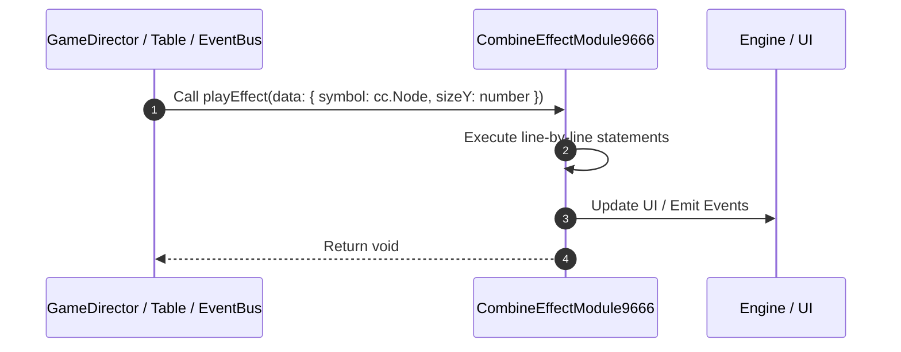

# 📖 `CombineEffectModule9666.playEffect()`

<!-- convention-summary-start -->
### CombineEffectModule9666.playEffect Line-by-Line Method Walkthrough Summary

- **Core Architecture / Purpose**: Technical reference, API contract, and integration guide for CombineEffectModule9666.playEffect Line-by-Line Method Walkthrough.
- **Key Mechanisms & Design**: Encapsulates core algorithms, event hooks, and performance optimizations within the slot framework runtime.
- **Domain Capabilities**: game_implement, 03_methods
- **Scope & Code Paths**: `file:///C:/Users/ADMIN/lamnino/cc20-new-all-in-one/assets/cc-release-slot/cc1-red-cliff/scripts/Payline/CombineEffectModule9666.ts`
- **Related Docs**: [Master Index](../INDEX.md)
<!-- convention-summary-end -->


---

## 1. Method Signature & Overview

```typescript
public playEffect(data: { symbol: cc.Node, sizeY: number }): void
```

- **Declaring Class**: `CombineEffectModule9666` ([`CombineEffectModule9666.ts`](file:///C:/Users/ADMIN/lamnino/cc20-new-all-in-one/assets/cc-release-slot/cc1-red-cliff/scripts/Payline/CombineEffectModule9666.ts))
- **Source Range**: Lines 44 to 85
- **Execution Cost**: $O(1)$ synchronous logic or timer Promise.

---

## 2. Complete Source Implementation

```typescript
	private playEffect(data: { symbol: cc.Node, sizeY: number }): void {
		let { symbol, sizeY } = data;

		if (!symbol || !this.vfxPool) {
			return;
		}

		// Check if this symbol already has an active effect
		const existing = this._activeEffects.find(eff => eff.symbolNode === symbol && !eff.isDying);
		if (existing) {
			return;
		}

		const effectNode = this.vfxPool.getObject();
		if (!effectNode) {
			return;
		}

		effectNode.parent = this.layerContainer;
		effectNode.setPosition(symbol.position);
		effectNode.zIndex = 10;
		effectNode.active = true;

		// Get or add CombineEffectNode9666 component to control the effect
		let effectComp = effectNode.getComponent(CombineEffectNode9666);
		effectComp.playIn(sizeY, this.speed);

		const isFirstEffect = this._activeEffects.length === 0;

		const activeEff: ActiveEffect = { effectNode, symbolNode: symbol, sizeY };
		this._activeEffects.push(activeEff);

		if (isFirstEffect) {
			this.eventManager.emit('ON_START_COMBINE_EFFECT');
			this.eventManager.emit('SHOW_MULTIPLIER_PANEL');
		}

		// Bind disappear event
		symbol.on('PLAY_ANIMATION_DISAPPEAR', () => {
			this.playOutEffect(activeEff);
		}, this);
	}
```

---

## 3. Line-by-Line Code Breakdown

| Line # | Code Snippet | Technical Analysis & Engine Behavior |
| :---: | :--- | :--- |
| **44** | `private playEffect(data: { symbol: cc.Node, sizeY: number }): void {` | Method entry signature declaring `playEffect(data: { symbol: cc.Node, sizeY: number })` returning `void`. |
| **45** | `let { symbol, sizeY } = data;` | Allocates local variable `{ symbol, sizeY }`. |
| **46** | `` | Executes core logic. |
| **47** | `if (!symbol \|\| !this.vfxPool) {` | Conditional guard evaluating branching prerequisite. |
| **48** | `return;` | Returns value or promise to calling sequence. |
| **49** | `}` | Scope boundary closing block. |
| **50** | `` | Executes core logic. |
| **51** | `// Check if this symbol already has an active effect` | Executes core logic. |
| **52** | `const existing = this._activeEffects.find(eff => eff.symbolNode === symbol && !eff.isDying);` | Allocates local variable `existing`. |
| **53** | `if (existing) {` | Conditional guard evaluating branching prerequisite. |
| **54** | `return;` | Returns value or promise to calling sequence. |
| **55** | `}` | Scope boundary closing block. |
| **56** | `` | Executes core logic. |
| **57** | `const effectNode = this.vfxPool.getObject();` | Allocates local variable `effectNode`. |
| **58** | `if (!effectNode) {` | Conditional guard evaluating branching prerequisite. |
| **59** | `return;` | Returns value or promise to calling sequence. |
| **60** | `}` | Scope boundary closing block. |
| **61** | `` | Executes core logic. |
| **62** | `effectNode.parent = this.layerContainer;` | Executes core logic. |
| **63** | `effectNode.setPosition(symbol.position);` | Executes core logic. |
| **64** | `effectNode.zIndex = 10;` | Executes core logic. |
| **65** | `effectNode.active = true;` | Executes core logic. |
| **66** | `` | Executes core logic. |
| **67** | `// Get or add CombineEffectNode9666 component to control the effect` | Executes core logic. |
| **68** | `let effectComp = effectNode.getComponent(CombineEffectNode9666);` | Allocates local variable `effectComp`. |
| **69** | `effectComp.playIn(sizeY, this.speed);` | Executes core logic. |
| **70** | `` | Executes core logic. |
| **71** | `const isFirstEffect = this._activeEffects.length === 0;` | Allocates local variable `isFirstEffect`. |
| **72** | `` | Executes core logic. |
| **73** | `const activeEff: ActiveEffect = { effectNode, symbolNode: symbol, sizeY };` | Allocates local variable `activeEff: ActiveEffect`. |
| **74** | `this._activeEffects.push(activeEff);` | Executes core logic. |
| **75** | `` | Executes core logic. |
| **76** | `if (isFirstEffect) {` | Conditional guard evaluating branching prerequisite. |
| **77** | `this.eventManager.emit('ON_START_COMBINE_EFFECT');` | Dispatches event `ON_START_COMBINE_EFFECT` to subscribers. |
| **78** | `this.eventManager.emit('SHOW_MULTIPLIER_PANEL');` | Dispatches event `SHOW_MULTIPLIER_PANEL` to subscribers. |
| **79** | `}` | Scope boundary closing block. |
| **80** | `` | Executes core logic. |
| **81** | `// Bind disappear event` | Executes core logic. |
| **82** | `symbol.on('PLAY_ANIMATION_DISAPPEAR', () => {` | Executes core logic. |
| **83** | `this.playOutEffect(activeEff);` | Executes core logic. |
| **84** | `}, this);` | Executes core logic. |
| **85** | `}` | Scope boundary closing block. |

---

## 4. Execution Call Graph & Sequence


