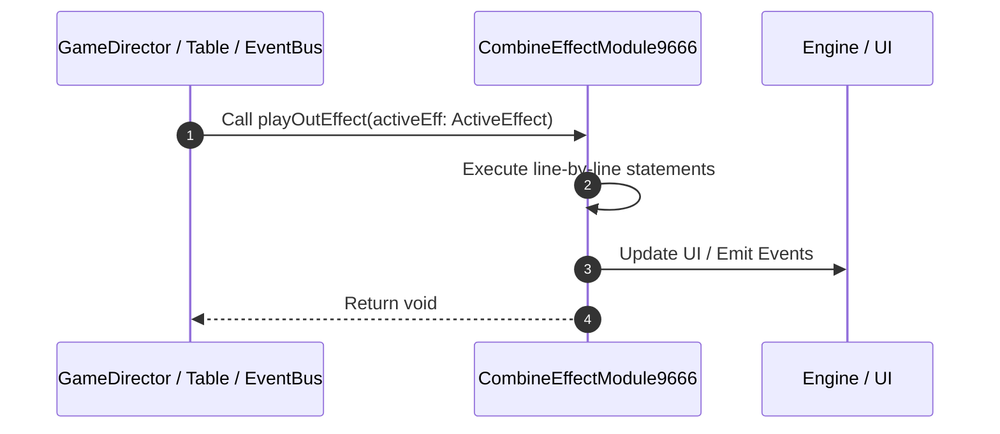

# 📖 `CombineEffectModule9666.playOutEffect()`

<!-- convention-summary-start -->
### CombineEffectModule9666.playOutEffect Line-by-Line Method Walkthrough Summary

- **Core Architecture / Purpose**: Technical reference, API contract, and integration guide for CombineEffectModule9666.playOutEffect Line-by-Line Method Walkthrough.
- **Key Mechanisms & Design**: Encapsulates core algorithms, event hooks, and performance optimizations within the slot framework runtime.
- **Domain Capabilities**: game_implement, 03_methods
- **Scope & Code Paths**: `file:///C:/Users/ADMIN/lamnino/cc20-new-all-in-one/assets/cc-release-slot/cc1-red-cliff/scripts/Payline/CombineEffectModule9666.ts`
- **Related Docs**: [Master Index](../INDEX.md)
<!-- convention-summary-end -->


---

## 1. Method Signature & Overview

```typescript
public playOutEffect(activeEff: ActiveEffect): void
```

- **Declaring Class**: `CombineEffectModule9666` ([`CombineEffectModule9666.ts`](file:///C:/Users/ADMIN/lamnino/cc20-new-all-in-one/assets/cc-release-slot/cc1-red-cliff/scripts/Payline/CombineEffectModule9666.ts))
- **Source Range**: Lines 87 to 102
- **Execution Cost**: $O(1)$ synchronous logic or timer Promise.

---

## 2. Complete Source Implementation

```typescript
	private playOutEffect(activeEff: ActiveEffect): void {
		if (activeEff.isDying) {
			return;
		}
		activeEff.isDying = true;

		const { effectNode } = activeEff;
		const effectComp = effectNode.getComponent(CombineEffectNode9666);
		if (effectComp) {
			effectComp.playOut(() => {
				this.removeEffect(activeEff);
			}, this.speed);
		} else {
			this.removeEffect(activeEff);
		}
	}
```

---

## 3. Line-by-Line Code Breakdown

| Line # | Code Snippet | Technical Analysis & Engine Behavior |
| :---: | :--- | :--- |
| **87** | `private playOutEffect(activeEff: ActiveEffect): void {` | Method entry signature declaring `playOutEffect(activeEff: ActiveEffect)` returning `void`. |
| **88** | `if (activeEff.isDying) {` | Conditional guard evaluating branching prerequisite. |
| **89** | `return;` | Returns value or promise to calling sequence. |
| **90** | `}` | Scope boundary closing block. |
| **91** | `activeEff.isDying = true;` | Executes core logic. |
| **92** | `` | Executes core logic. |
| **93** | `const { effectNode } = activeEff;` | Allocates local variable `{ effectNode }`. |
| **94** | `const effectComp = effectNode.getComponent(CombineEffectNode9666);` | Allocates local variable `effectComp`. |
| **95** | `if (effectComp) {` | Conditional guard evaluating branching prerequisite. |
| **96** | `effectComp.playOut(() => {` | Executes core logic. |
| **97** | `this.removeEffect(activeEff);` | Executes core logic. |
| **98** | `}, this.speed);` | Executes core logic. |
| **99** | `} else {` | Executes core logic. |
| **100** | `this.removeEffect(activeEff);` | Executes core logic. |
| **101** | `}` | Scope boundary closing block. |
| **102** | `}` | Scope boundary closing block. |

---

## 4. Execution Call Graph & Sequence


