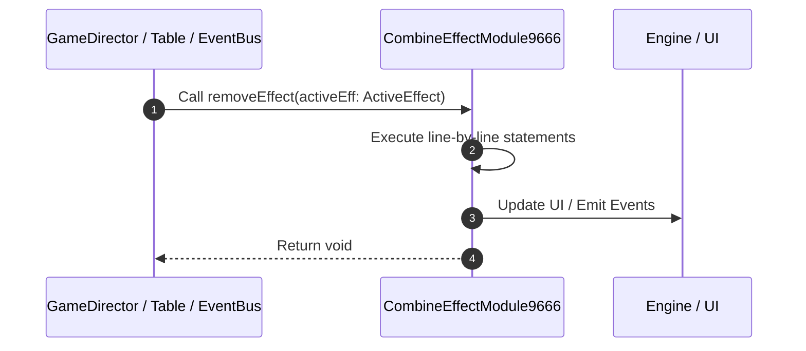

# 📖 `CombineEffectModule9666.removeEffect()`

<!-- convention-summary-start -->
### CombineEffectModule9666.removeEffect Line-by-Line Method Walkthrough Summary

- **Core Architecture / Purpose**: Technical reference, API contract, and integration guide for CombineEffectModule9666.removeEffect Line-by-Line Method Walkthrough.
- **Key Mechanisms & Design**: Encapsulates core algorithms, event hooks, and performance optimizations within the slot framework runtime.
- **Domain Capabilities**: game_implement, 03_methods
- **Scope & Code Paths**: `file:///C:/Users/ADMIN/lamnino/cc20-new-all-in-one/assets/cc-release-slot/cc1-red-cliff/scripts/Payline/CombineEffectModule9666.ts`
- **Related Docs**: [Master Index](../INDEX.md)
<!-- convention-summary-end -->


---

## 1. Method Signature & Overview

```typescript
public removeEffect(activeEff: ActiveEffect): void
```

- **Declaring Class**: `CombineEffectModule9666` ([`CombineEffectModule9666.ts`](file:///C:/Users/ADMIN/lamnino/cc20-new-all-in-one/assets/cc-release-slot/cc1-red-cliff/scripts/Payline/CombineEffectModule9666.ts))
- **Source Range**: Lines 104 to 118
- **Execution Cost**: $O(1)$ synchronous logic or timer Promise.

---

## 2. Complete Source Implementation

```typescript
	private removeEffect(activeEff: ActiveEffect): void {
		if (cc.isValid(activeEff.symbolNode)) {
			activeEff.symbolNode.targetOff(this);
		}
		
		if (cc.isValid(activeEff.effectNode)) {
			const effectComp = activeEff.effectNode.getComponent(CombineEffectNode9666);
			if (effectComp) {
				effectComp.resetState();
			}
			(this.vfxPool as any).returnObject(activeEff.effectNode);
		}

		this._activeEffects = this._activeEffects.filter(eff => eff !== activeEff);
	}
```

---

## 3. Line-by-Line Code Breakdown

| Line # | Code Snippet | Technical Analysis & Engine Behavior |
| :---: | :--- | :--- |
| **104** | `private removeEffect(activeEff: ActiveEffect): void {` | Method entry signature declaring `removeEffect(activeEff: ActiveEffect)` returning `void`. |
| **105** | `if (cc.isValid(activeEff.symbolNode)) {` | Conditional guard evaluating branching prerequisite. |
| **106** | `activeEff.symbolNode.targetOff(this);` | Executes core logic. |
| **107** | `}` | Scope boundary closing block. |
| **108** | `` | Executes core logic. |
| **109** | `if (cc.isValid(activeEff.effectNode)) {` | Conditional guard evaluating branching prerequisite. |
| **110** | `const effectComp = activeEff.effectNode.getComponent(CombineEffectNode9666);` | Allocates local variable `effectComp`. |
| **111** | `if (effectComp) {` | Conditional guard evaluating branching prerequisite. |
| **112** | `effectComp.resetState();` | Executes core logic. |
| **113** | `}` | Scope boundary closing block. |
| **114** | `(this.vfxPool as any).returnObject(activeEff.effectNode);` | Executes core logic. |
| **115** | `}` | Scope boundary closing block. |
| **116** | `` | Executes core logic. |
| **117** | `this._activeEffects = this._activeEffects.filter(eff => eff !== activeEff);` | Executes core logic. |
| **118** | `}` | Scope boundary closing block. |

---

## 4. Execution Call Graph & Sequence


