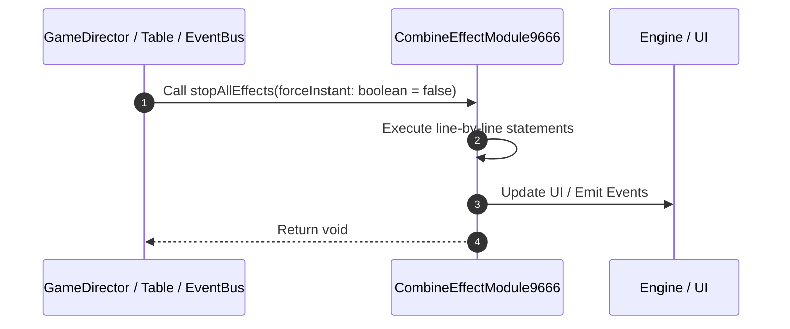

# 📖 `CombineEffectModule9666.stopAllEffects()`

<!-- convention-summary-start -->
### CombineEffectModule9666.stopAllEffects Line-by-Line Method Walkthrough Summary

- **Core Architecture / Purpose**: Technical reference, API contract, and integration guide for CombineEffectModule9666.stopAllEffects Line-by-Line Method Walkthrough.
- **Key Mechanisms & Design**: Encapsulates core algorithms, event hooks, and performance optimizations within the slot framework runtime.
- **Domain Capabilities**: game_implement, 03_methods
- **Scope & Code Paths**: `file:///C:/Users/ADMIN/lamnino/cc20-new-all-in-one/assets/cc-release-slot/cc1-red-cliff/scripts/Payline/CombineEffectModule9666.ts`
- **Related Docs**: [Master Index](../INDEX.md)
<!-- convention-summary-end -->


---

## 1. Method Signature & Overview

```typescript
public stopAllEffects(forceInstant: boolean = false): void
```

- **Declaring Class**: `CombineEffectModule9666` ([`CombineEffectModule9666.ts`](file:///C:/Users/ADMIN/lamnino/cc20-new-all-in-one/assets/cc-release-slot/cc1-red-cliff/scripts/Payline/CombineEffectModule9666.ts))
- **Source Range**: Lines 120 to 143
- **Execution Cost**: $O(1)$ synchronous logic or timer Promise.

---

## 2. Complete Source Implementation

```typescript
	private stopAllEffects(forceInstant: boolean = false): void {
		this.unscheduleAllCallbacks();
		this.eventManager.emit('ON_CLEAR_COMBINE_EFFECT');
		const effectsToProcess = [...this._activeEffects];
		for (const eff of effectsToProcess) {
			if (cc.isValid(eff.symbolNode)) {
				eff.symbolNode.targetOff(this);
			}
			if (cc.isValid(eff.effectNode)) {
				if (forceInstant) {
					const effectComp = eff.effectNode.getComponent(CombineEffectNode9666);
					if (effectComp) {
						effectComp.resetState();
					}
					this.vfxPool.returnObject(eff.effectNode);
				} else {
					this.playOutEffect(eff);
				}
			}
		}
		if (forceInstant) {
			this._activeEffects = [];
		}
	}
```

---

## 3. Line-by-Line Code Breakdown

| Line # | Code Snippet | Technical Analysis & Engine Behavior |
| :---: | :--- | :--- |
| **120** | `private stopAllEffects(forceInstant: boolean = false): void {` | Method entry signature declaring `stopAllEffects(forceInstant: boolean = false)` returning `void`. |
| **121** | `this.unscheduleAllCallbacks();` | Executes core logic. |
| **122** | `this.eventManager.emit('ON_CLEAR_COMBINE_EFFECT');` | Dispatches event `ON_CLEAR_COMBINE_EFFECT` to subscribers. |
| **123** | `const effectsToProcess = [...this._activeEffects];` | Allocates local variable `effectsToProcess`. |
| **124** | `for (const eff of effectsToProcess) {` | Executes core logic. |
| **125** | `if (cc.isValid(eff.symbolNode)) {` | Conditional guard evaluating branching prerequisite. |
| **126** | `eff.symbolNode.targetOff(this);` | Executes core logic. |
| **127** | `}` | Scope boundary closing block. |
| **128** | `if (cc.isValid(eff.effectNode)) {` | Conditional guard evaluating branching prerequisite. |
| **129** | `if (forceInstant) {` | Conditional guard evaluating branching prerequisite. |
| **130** | `const effectComp = eff.effectNode.getComponent(CombineEffectNode9666);` | Allocates local variable `effectComp`. |
| **131** | `if (effectComp) {` | Conditional guard evaluating branching prerequisite. |
| **132** | `effectComp.resetState();` | Executes core logic. |
| **133** | `}` | Scope boundary closing block. |
| **134** | `this.vfxPool.returnObject(eff.effectNode);` | Executes core logic. |
| **135** | `} else {` | Executes core logic. |
| **136** | `this.playOutEffect(eff);` | Executes core logic. |
| **137** | `}` | Scope boundary closing block. |
| **138** | `}` | Scope boundary closing block. |
| **139** | `}` | Scope boundary closing block. |
| **140** | `if (forceInstant) {` | Conditional guard evaluating branching prerequisite. |
| **141** | `this._activeEffects = [];` | Executes core logic. |
| **142** | `}` | Scope boundary closing block. |
| **143** | `}` | Scope boundary closing block. |

---

## 4. Execution Call Graph & Sequence


