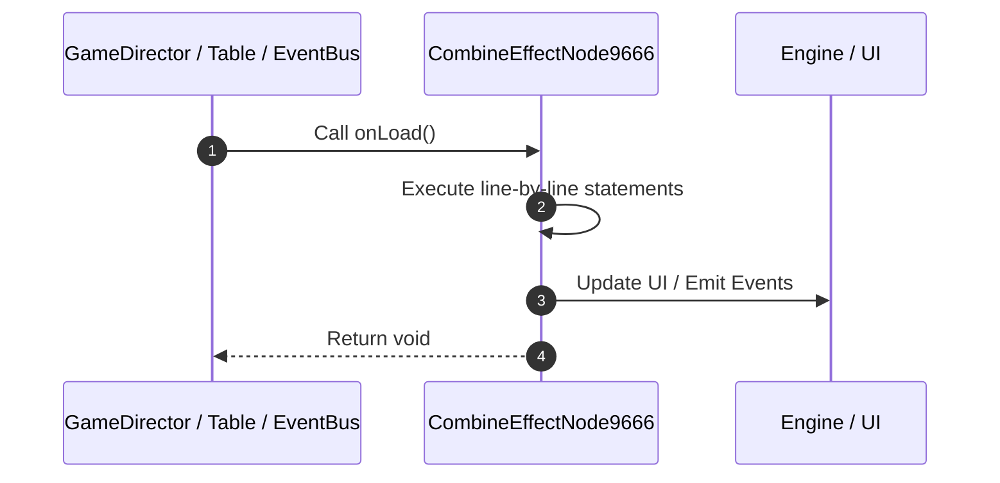

# 📖 `CombineEffectNode9666.onLoad()`

<!-- convention-summary-start -->
### CombineEffectNode9666.onLoad Line-by-Line Method Walkthrough Summary

- **Core Architecture / Purpose**: Technical reference, API contract, and integration guide for CombineEffectNode9666.onLoad Line-by-Line Method Walkthrough.
- **Key Mechanisms & Design**: Encapsulates core algorithms, event hooks, and performance optimizations within the slot framework runtime.
- **Domain Capabilities**: game_implement, 03_methods
- **Scope & Code Paths**: `file:///C:/Users/ADMIN/lamnino/cc20-new-all-in-one/assets/cc-release-slot/cc1-red-cliff/scripts/Payline/CombineEffectNode9666.ts`
- **Related Docs**: [Master Index](../INDEX.md)
<!-- convention-summary-end -->


---

## 1. Method Signature & Overview

```typescript
public onLoad(): void
```

- **Declaring Class**: `CombineEffectNode9666` ([`CombineEffectNode9666.ts`](file:///C:/Users/ADMIN/lamnino/cc20-new-all-in-one/assets/cc-release-slot/cc1-red-cliff/scripts/Payline/CombineEffectNode9666.ts))
- **Source Range**: Lines 9 to 13
- **Execution Cost**: $O(1)$ synchronous logic or timer Promise.

---

## 2. Complete Source Implementation

```typescript
	onLoad(): void {
		if (!this.spine) {
			this.spine = this.getComponentInChildren(sp.Skeleton) || this.getComponent(sp.Skeleton);
		}
	}
```

---

## 3. Line-by-Line Code Breakdown

| Line # | Code Snippet | Technical Analysis & Engine Behavior |
| :---: | :--- | :--- |
| **9** | `onLoad(): void {` | Method entry signature declaring `onLoad()` returning `void`. |
| **10** | `if (!this.spine) {` | Conditional guard evaluating branching prerequisite. |
| **11** | `this.spine = this.getComponentInChildren(sp.Skeleton) \|\| this.getComponent(sp.Skeleton);` | Executes core logic. |
| **12** | `}` | Scope boundary closing block. |
| **13** | `}` | Scope boundary closing block. |

---

## 4. Execution Call Graph & Sequence


