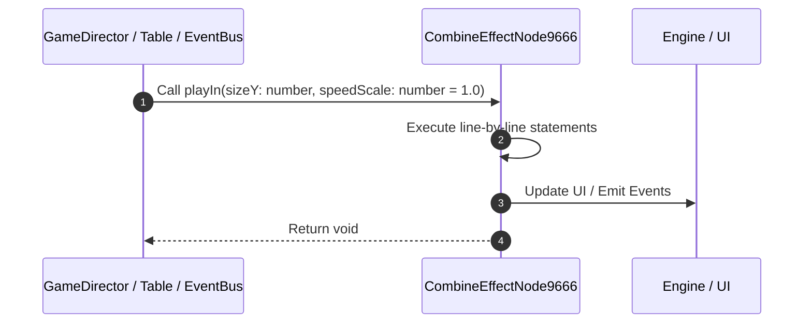

# 📖 `CombineEffectNode9666.playIn()`

<!-- convention-summary-start -->
### CombineEffectNode9666.playIn Line-by-Line Method Walkthrough Summary

- **Core Architecture / Purpose**: Technical reference, API contract, and integration guide for CombineEffectNode9666.playIn Line-by-Line Method Walkthrough.
- **Key Mechanisms & Design**: Encapsulates core algorithms, event hooks, and performance optimizations within the slot framework runtime.
- **Domain Capabilities**: game_implement, 03_methods
- **Scope & Code Paths**: `file:///C:/Users/ADMIN/lamnino/cc20-new-all-in-one/assets/cc-release-slot/cc1-red-cliff/scripts/Payline/CombineEffectNode9666.ts`
- **Related Docs**: [Master Index](../INDEX.md)
<!-- convention-summary-end -->


---

## 1. Method Signature & Overview

```typescript
public playIn(sizeY: number, speedScale: number = 1.0): void
```

- **Declaring Class**: `CombineEffectNode9666` ([`CombineEffectNode9666.ts`](file:///C:/Users/ADMIN/lamnino/cc20-new-all-in-one/assets/cc-release-slot/cc1-red-cliff/scripts/Payline/CombineEffectNode9666.ts))
- **Source Range**: Lines 15 to 25
- **Execution Cost**: $O(1)$ synchronous logic or timer Promise.

---

## 2. Complete Source Implementation

```typescript
	public playIn(sizeY: number, speedScale: number = 1.0): void {
		this._sizeY = sizeY;
		if (this.spine && this.spine.skeletonData) {
			this.spine.timeScale = speedScale;
			this.spine.clearTracks();
			this.spine.setToSetupPose();
			const animIndex = Math.min(sizeY, 3);
			this.spine.setAnimation(0, `eff_in_${animIndex}`, false);
			this.spine.addAnimation(0, `eff_loop_${animIndex}`, true);
		}
	}
```

---

## 3. Line-by-Line Code Breakdown

| Line # | Code Snippet | Technical Analysis & Engine Behavior |
| :---: | :--- | :--- |
| **15** | `public playIn(sizeY: number, speedScale: number = 1.0): void {` | Method entry signature declaring `playIn(sizeY: number, speedScale: number = 1.0)` returning `void`. |
| **16** | `this._sizeY = sizeY;` | Executes core logic. |
| **17** | `if (this.spine && this.spine.skeletonData) {` | Conditional guard evaluating branching prerequisite. |
| **18** | `this.spine.timeScale = speedScale;` | Executes core logic. |
| **19** | `this.spine.clearTracks();` | Executes core logic. |
| **20** | `this.spine.setToSetupPose();` | Executes core logic. |
| **21** | `const animIndex = Math.min(sizeY, 3);` | Allocates local variable `animIndex`. |
| **22** | `this.spine.setAnimation(0, `eff_in_${animIndex}`, false);` | Executes core logic. |
| **23** | `this.spine.addAnimation(0, `eff_loop_${animIndex}`, true);` | Executes core logic. |
| **24** | `}` | Scope boundary closing block. |
| **25** | `}` | Scope boundary closing block. |

---

## 4. Execution Call Graph & Sequence


