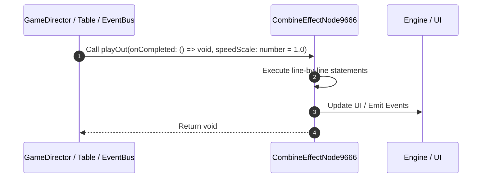

# 📖 `CombineEffectNode9666.playOut()`

<!-- convention-summary-start -->
### CombineEffectNode9666.playOut Line-by-Line Method Walkthrough Summary

- **Core Architecture / Purpose**: Technical reference, API contract, and integration guide for CombineEffectNode9666.playOut Line-by-Line Method Walkthrough.
- **Key Mechanisms & Design**: Encapsulates core algorithms, event hooks, and performance optimizations within the slot framework runtime.
- **Domain Capabilities**: game_implement, 03_methods
- **Scope & Code Paths**: `file:///C:/Users/ADMIN/lamnino/cc20-new-all-in-one/assets/cc-release-slot/cc1-red-cliff/scripts/Payline/CombineEffectNode9666.ts`
- **Related Docs**: [Master Index](../INDEX.md)
<!-- convention-summary-end -->


---

## 1. Method Signature & Overview

```typescript
public playOut(onCompleted: () => void, speedScale: number = 1.0): void
```

- **Declaring Class**: `CombineEffectNode9666` ([`CombineEffectNode9666.ts`](file:///C:/Users/ADMIN/lamnino/cc20-new-all-in-one/assets/cc-release-slot/cc1-red-cliff/scripts/Payline/CombineEffectNode9666.ts))
- **Source Range**: Lines 27 to 42
- **Execution Cost**: $O(1)$ synchronous logic or timer Promise.

---

## 2. Complete Source Implementation

```typescript
	public playOut(onCompleted: () => void, speedScale: number = 1.0): void {
		if (this.spine && this.spine.skeletonData) {
			this.spine.timeScale = speedScale;
			const animIndex = Math.min(this._sizeY, 3);
			this.spine.setAnimation(0, `eff_out_${animIndex}`, false);
			
			this.spine.setCompleteListener((trackEntry) => {
				if (trackEntry && trackEntry.animation && trackEntry.animation.name === `eff_out_${animIndex}`) {
					this.spine.setCompleteListener(null);
					onCompleted && onCompleted();
				}
			});
		} else {
			onCompleted && onCompleted();
		}
	}
```

---

## 3. Line-by-Line Code Breakdown

| Line # | Code Snippet | Technical Analysis & Engine Behavior |
| :---: | :--- | :--- |
| **27** | `public playOut(onCompleted: () => void, speedScale: number = 1.0): void {` | Method entry signature declaring `playOut(onCompleted: () => void, speedScale: number = 1.0)` returning `void`. |
| **28** | `if (this.spine && this.spine.skeletonData) {` | Conditional guard evaluating branching prerequisite. |
| **29** | `this.spine.timeScale = speedScale;` | Executes core logic. |
| **30** | `const animIndex = Math.min(this._sizeY, 3);` | Allocates local variable `animIndex`. |
| **31** | `this.spine.setAnimation(0, `eff_out_${animIndex}`, false);` | Executes core logic. |
| **32** | `` | Executes core logic. |
| **33** | `this.spine.setCompleteListener((trackEntry) => {` | Executes core logic. |
| **34** | `if (trackEntry && trackEntry.animation && trackEntry.animation.name === `eff_out_${animIndex}`) {` | Conditional guard evaluating branching prerequisite. |
| **35** | `this.spine.setCompleteListener(null);` | Executes core logic. |
| **36** | `onCompleted && onCompleted();` | Executes core logic. |
| **37** | `}` | Scope boundary closing block. |
| **38** | `});` | Executes core logic. |
| **39** | `} else {` | Executes core logic. |
| **40** | `onCompleted && onCompleted();` | Executes core logic. |
| **41** | `}` | Scope boundary closing block. |
| **42** | `}` | Scope boundary closing block. |

---

## 4. Execution Call Graph & Sequence


