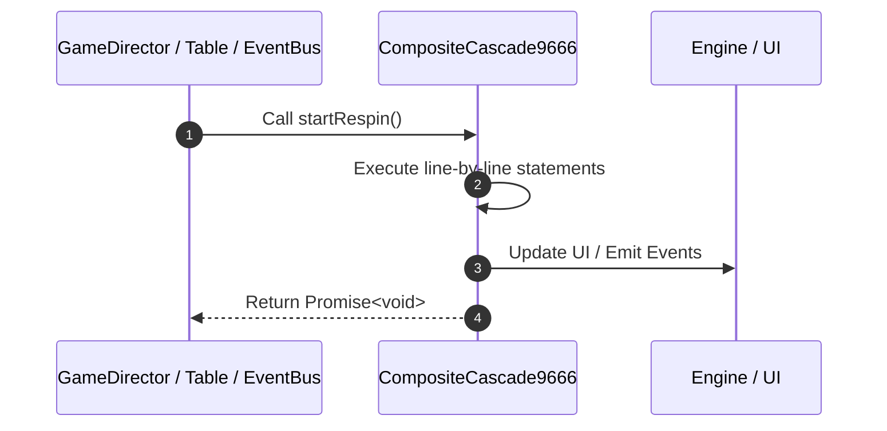

# 📖 `CompositeCascade9666.startRespin()`

<!-- convention-summary-start -->
### CompositeCascade9666.startRespin Line-by-Line Method Walkthrough Summary

- **Core Architecture / Purpose**: Technical reference, API contract, and integration guide for CompositeCascade9666.startRespin Line-by-Line Method Walkthrough.
- **Key Mechanisms & Design**: Encapsulates core algorithms, event hooks, and performance optimizations within the slot framework runtime.
- **Domain Capabilities**: game_implement, 03_methods
- **Scope & Code Paths**: `file:///C:/Users/ADMIN/lamnino/cc20-new-all-in-one/assets/cc-release-slot/cc1-red-cliff/scripts/Table/CompositeCascade9666.ts`
- **Related Docs**: [Master Index](../INDEX.md)
<!-- convention-summary-end -->


---

## 1. Method Signature & Overview

```typescript
public startRespin(): Promise<void>
```

- **Declaring Class**: `CompositeCascade9666` ([`CompositeCascade9666.ts`](file:///C:/Users/ADMIN/lamnino/cc20-new-all-in-one/assets/cc-release-slot/cc1-red-cliff/scripts/Table/CompositeCascade9666.ts))
- **Source Range**: Lines 8 to 14
- **Execution Cost**: $O(1)$ synchronous logic or timer Promise.

---

## 2. Complete Source Implementation

```typescript
	async startRespin(): Promise<void> {
		const { verticalMatrix, horizonMatrix, listTraceWayVertical, listTraceWayHorizontal } = this._compositeCascadeData.formatData();
		const p1 = this.verticalCascadeModule.startRespin(verticalMatrix, listTraceWayVertical);
		const p2 = this.horizontalCascadeModule.startRespin(horizonMatrix, listTraceWayHorizontal);
		await Promise.all([p1, p2]);
		await this.moduleEvent.emit('UPDATE_JACKPOT_COLLECTION');
	}
```

---

## 3. Line-by-Line Code Breakdown

| Line # | Code Snippet | Technical Analysis & Engine Behavior |
| :---: | :--- | :--- |
| **8** | `async startRespin(): Promise<void> {` | Method entry signature declaring `startRespin()` returning `Promise<void>`. |
| **9** | `const { verticalMatrix, horizonMatrix, listTraceWayVertical, listTraceWayHorizontal } = this._compositeCascadeData.formatData();` | Allocates local variable `{ verticalMatrix, horizonMatrix, listTraceWayVertical, listTraceWayHorizontal }`. |
| **10** | `const p1 = this.verticalCascadeModule.startRespin(verticalMatrix, listTraceWayVertical);` | Allocates local variable `p1`. |
| **11** | `const p2 = this.horizontalCascadeModule.startRespin(horizonMatrix, listTraceWayHorizontal);` | Allocates local variable `p2`. |
| **12** | `await Promise.all([p1, p2]);` | Executes core logic. |
| **13** | `await this.moduleEvent.emit('UPDATE_JACKPOT_COLLECTION');` | Dispatches event `UPDATE_JACKPOT_COLLECTION` to subscribers. |
| **14** | `}` | Scope boundary closing block. |

---

## 4. Execution Call Graph & Sequence


