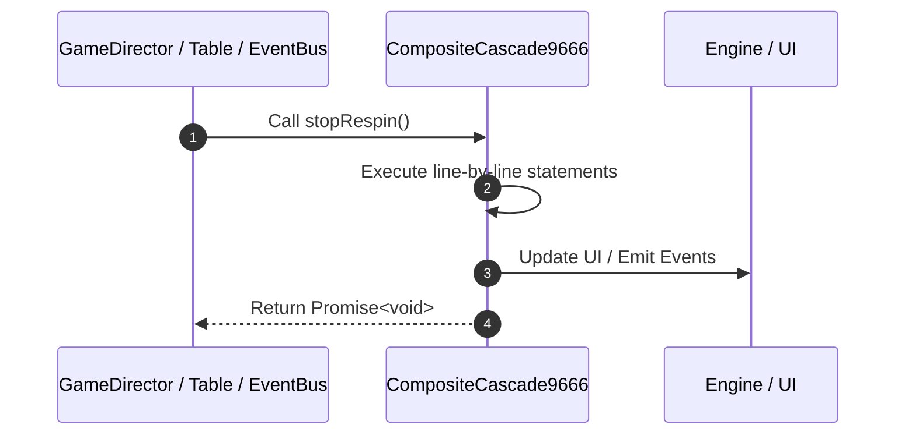

# 📖 `CompositeCascade9666.stopRespin()`

<!-- convention-summary-start -->
### CompositeCascade9666.stopRespin Line-by-Line Method Walkthrough Summary

- **Core Architecture / Purpose**: Technical reference, API contract, and integration guide for CompositeCascade9666.stopRespin Line-by-Line Method Walkthrough.
- **Key Mechanisms & Design**: Encapsulates core algorithms, event hooks, and performance optimizations within the slot framework runtime.
- **Domain Capabilities**: game_implement, 03_methods
- **Scope & Code Paths**: `file:///C:/Users/ADMIN/lamnino/cc20-new-all-in-one/assets/cc-release-slot/cc1-red-cliff/scripts/Table/CompositeCascade9666.ts`
- **Related Docs**: [Master Index](../INDEX.md)
<!-- convention-summary-end -->


---

## 1. Method Signature & Overview

```typescript
public stopRespin(): Promise<void>
```

- **Declaring Class**: `CompositeCascade9666` ([`CompositeCascade9666.ts`](file:///C:/Users/ADMIN/lamnino/cc20-new-all-in-one/assets/cc-release-slot/cc1-red-cliff/scripts/Table/CompositeCascade9666.ts))
- **Source Range**: Lines 16 to 22
- **Execution Cost**: $O(1)$ synchronous logic or timer Promise.

---

## 2. Complete Source Implementation

```typescript
	async stopRespin(): Promise<void> {
		const formatMatrix = this._compositeCascadeData.getFormatMatrix();
		const totalWays = formatMatrix.reduce((total, column) => total * column.length, 1);
		await this.moduleEvent.emit('UPDATE_MEGAWAY', totalWays);
		await super.stopRespin();
		await this.moduleEvent.emit('STACK_WILD_LANDED');
	}
```

---

## 3. Line-by-Line Code Breakdown

| Line # | Code Snippet | Technical Analysis & Engine Behavior |
| :---: | :--- | :--- |
| **16** | `async stopRespin(): Promise<void> {` | Method entry signature declaring `stopRespin()` returning `Promise<void>`. |
| **17** | `const formatMatrix = this._compositeCascadeData.getFormatMatrix();` | Allocates local variable `formatMatrix`. |
| **18** | `const totalWays = formatMatrix.reduce((total, column) => total * column.length, 1);` | Allocates local variable `totalWays`. |
| **19** | `await this.moduleEvent.emit('UPDATE_MEGAWAY', totalWays);` | Dispatches event `UPDATE_MEGAWAY` to subscribers. |
| **20** | `await super.stopRespin();` | Delegates to parent superclass lifecycle implementation. |
| **21** | `await this.moduleEvent.emit('STACK_WILD_LANDED');` | Dispatches event `STACK_WILD_LANDED` to subscribers. |
| **22** | `}` | Scope boundary closing block. |

---

## 4. Execution Call Graph & Sequence


