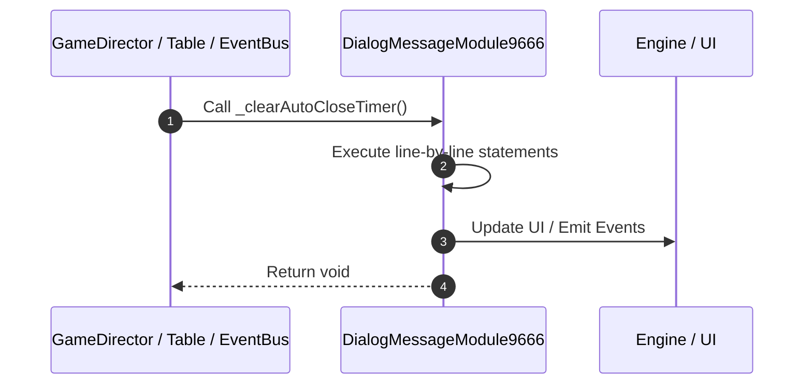

# 📖 `DialogMessageModule9666._clearAutoCloseTimer()`

<!-- convention-summary-start -->
### DialogMessageModule9666._clearAutoCloseTimer Line-by-Line Method Walkthrough Summary

- **Core Architecture / Purpose**: Technical reference, API contract, and integration guide for DialogMessageModule9666._clearAutoCloseTimer Line-by-Line Method Walkthrough.
- **Key Mechanisms & Design**: Encapsulates core algorithms, event hooks, and performance optimizations within the slot framework runtime.
- **Domain Capabilities**: game_implement, 03_methods
- **Scope & Code Paths**: `file:///C:/Users/ADMIN/lamnino/cc20-new-all-in-one/assets/cc-release-slot/cc1-red-cliff/scripts/Gui/DialogMessageModule9666.ts`
- **Related Docs**: [Master Index](../INDEX.md)
<!-- convention-summary-end -->


---

## 1. Method Signature & Overview

```typescript
public _clearAutoCloseTimer(): void
```

- **Declaring Class**: `DialogMessageModule9666` ([`DialogMessageModule9666.ts`](file:///C:/Users/ADMIN/lamnino/cc20-new-all-in-one/assets/cc-release-slot/cc1-red-cliff/scripts/Gui/DialogMessageModule9666.ts))
- **Source Range**: Lines 81 to 86
- **Execution Cost**: $O(1)$ synchronous logic or timer Promise.

---

## 2. Complete Source Implementation

```typescript
	private _clearAutoCloseTimer(): void {
		if (this._tweenAutoClose) {
			this._tweenAutoClose.stop();
			this._tweenAutoClose = null;
		}
	}
```

---

## 3. Line-by-Line Code Breakdown

| Line # | Code Snippet | Technical Analysis & Engine Behavior |
| :---: | :--- | :--- |
| **81** | `private _clearAutoCloseTimer(): void {` | Method entry signature declaring `_clearAutoCloseTimer()` returning `void`. |
| **82** | `if (this._tweenAutoClose) {` | Conditional guard evaluating branching prerequisite. |
| **83** | `this._tweenAutoClose.stop();` | Executes core logic. |
| **84** | `this._tweenAutoClose = null;` | Executes core logic. |
| **85** | `}` | Scope boundary closing block. |
| **86** | `}` | Scope boundary closing block. |

---

## 4. Execution Call Graph & Sequence


