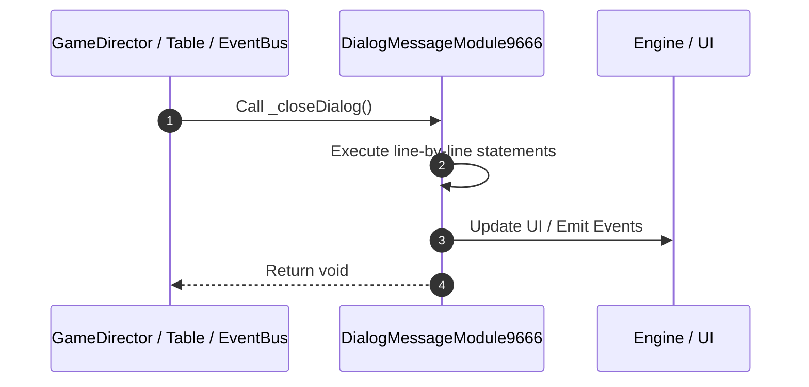

# 📖 `DialogMessageModule9666._closeDialog()`

<!-- convention-summary-start -->
### DialogMessageModule9666._closeDialog Line-by-Line Method Walkthrough Summary

- **Core Architecture / Purpose**: Technical reference, API contract, and integration guide for DialogMessageModule9666._closeDialog Line-by-Line Method Walkthrough.
- **Key Mechanisms & Design**: Encapsulates core algorithms, event hooks, and performance optimizations within the slot framework runtime.
- **Domain Capabilities**: game_implement, 03_methods
- **Scope & Code Paths**: `file:///C:/Users/ADMIN/lamnino/cc20-new-all-in-one/assets/cc-release-slot/cc1-red-cliff/scripts/Gui/DialogMessageModule9666.ts`
- **Related Docs**: [Master Index](../INDEX.md)
<!-- convention-summary-end -->


---

## 1. Method Signature & Overview

```typescript
public _closeDialog(): void
```

- **Declaring Class**: `DialogMessageModule9666` ([`DialogMessageModule9666.ts`](file:///C:/Users/ADMIN/lamnino/cc20-new-all-in-one/assets/cc-release-slot/cc1-red-cliff/scripts/Gui/DialogMessageModule9666.ts))
- **Source Range**: Lines 68 to 79
- **Execution Cost**: $O(1)$ synchronous logic or timer Promise.

---

## 2. Complete Source Implementation

```typescript
	private _closeDialog(): void {
		this._clearAutoCloseTimer();
		const dialogManager = this.gameLogic.getDialogManager ? this.gameLogic.getDialogManager() : null;
		if (dialogManager && typeof dialogManager.hideDialog === 'function') {
			dialogManager.hideDialog();
		} else {
			if (this.dialogData) {
				this.dialogData.active = false;
			}
			this.node.active = false;
		}
	}
```

---

## 3. Line-by-Line Code Breakdown

| Line # | Code Snippet | Technical Analysis & Engine Behavior |
| :---: | :--- | :--- |
| **68** | `private _closeDialog(): void {` | Method entry signature declaring `_closeDialog()` returning `void`. |
| **69** | `this._clearAutoCloseTimer();` | Executes core logic. |
| **70** | `const dialogManager = this.gameLogic.getDialogManager ? this.gameLogic.getDialogManager() : null;` | Allocates local variable `dialogManager`. |
| **71** | `if (dialogManager && typeof dialogManager.hideDialog === 'function') {` | Conditional guard evaluating branching prerequisite. |
| **72** | `dialogManager.hideDialog();` | Executes core logic. |
| **73** | `} else {` | Executes core logic. |
| **74** | `if (this.dialogData) {` | Conditional guard evaluating branching prerequisite. |
| **75** | `this.dialogData.active = false;` | Executes core logic. |
| **76** | `}` | Scope boundary closing block. |
| **77** | `this.node.active = false;` | Executes core logic. |
| **78** | `}` | Scope boundary closing block. |
| **79** | `}` | Scope boundary closing block. |

---

## 4. Execution Call Graph & Sequence


