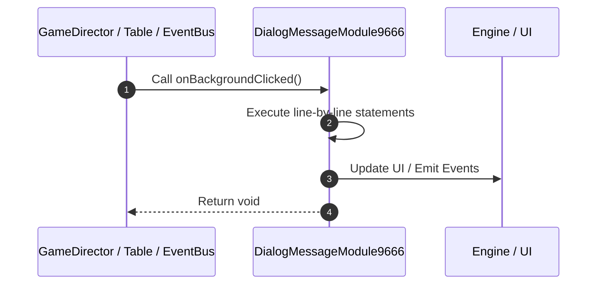

# 📖 `DialogMessageModule9666.onBackgroundClicked()`

<!-- convention-summary-start -->
### DialogMessageModule9666.onBackgroundClicked Line-by-Line Method Walkthrough Summary

- **Core Architecture / Purpose**: Technical reference, API contract, and integration guide for DialogMessageModule9666.onBackgroundClicked Line-by-Line Method Walkthrough.
- **Key Mechanisms & Design**: Encapsulates core algorithms, event hooks, and performance optimizations within the slot framework runtime.
- **Domain Capabilities**: game_implement, 03_methods
- **Scope & Code Paths**: `file:///C:/Users/ADMIN/lamnino/cc20-new-all-in-one/assets/cc-release-slot/cc1-red-cliff/scripts/Gui/DialogMessageModule9666.ts`
- **Related Docs**: [Master Index](../INDEX.md)
<!-- convention-summary-end -->


---

## 1. Method Signature & Overview

```typescript
public onBackgroundClicked(): void
```

- **Declaring Class**: `DialogMessageModule9666` ([`DialogMessageModule9666.ts`](file:///C:/Users/ADMIN/lamnino/cc20-new-all-in-one/assets/cc-release-slot/cc1-red-cliff/scripts/Gui/DialogMessageModule9666.ts))
- **Source Range**: Lines 38 to 45
- **Execution Cost**: $O(1)$ synchronous logic or timer Promise.

---

## 2. Complete Source Implementation

```typescript
	onBackgroundClicked(): void {
		const hasActionButtons = Boolean(
			this.dialogData && (this.dialogData.isOkBtnActive || this.dialogData.isCancelBtnActive)
		);
		if (!hasActionButtons) {
			this._closeDialog();
		}
	}
```

---

## 3. Line-by-Line Code Breakdown

| Line # | Code Snippet | Technical Analysis & Engine Behavior |
| :---: | :--- | :--- |
| **38** | `onBackgroundClicked(): void {` | Method entry signature declaring `onBackgroundClicked()` returning `void`. |
| **39** | `const hasActionButtons = Boolean(` | Allocates local variable `hasActionButtons`. |
| **40** | `this.dialogData && (this.dialogData.isOkBtnActive \|\| this.dialogData.isCancelBtnActive)` | Executes core logic. |
| **41** | `);` | Executes core logic. |
| **42** | `if (!hasActionButtons) {` | Conditional guard evaluating branching prerequisite. |
| **43** | `this._closeDialog();` | Executes core logic. |
| **44** | `}` | Scope boundary closing block. |
| **45** | `}` | Scope boundary closing block. |

---

## 4. Execution Call Graph & Sequence


