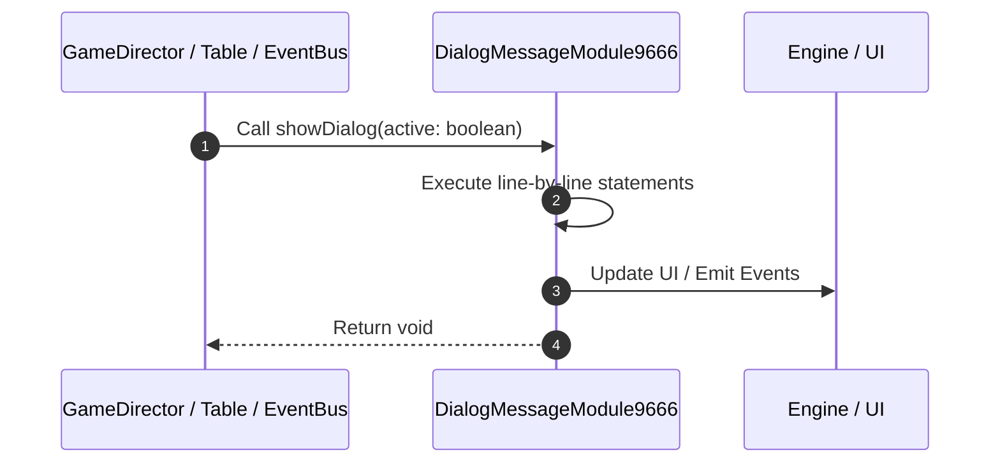

# 📖 `DialogMessageModule9666.showDialog()`

<!-- convention-summary-start -->
### DialogMessageModule9666.showDialog Line-by-Line Method Walkthrough Summary

- **Core Architecture / Purpose**: Technical reference, API contract, and integration guide for DialogMessageModule9666.showDialog Line-by-Line Method Walkthrough.
- **Key Mechanisms & Design**: Encapsulates core algorithms, event hooks, and performance optimizations within the slot framework runtime.
- **Domain Capabilities**: game_implement, 03_methods
- **Scope & Code Paths**: `file:///C:/Users/ADMIN/lamnino/cc20-new-all-in-one/assets/cc-release-slot/cc1-red-cliff/scripts/Gui/DialogMessageModule9666.ts`
- **Related Docs**: [Master Index](../INDEX.md)
<!-- convention-summary-end -->


---

## 1. Method Signature & Overview

```typescript
public showDialog(active: boolean): void
```

- **Declaring Class**: `DialogMessageModule9666` ([`DialogMessageModule9666.ts`](file:///C:/Users/ADMIN/lamnino/cc20-new-all-in-one/assets/cc-release-slot/cc1-red-cliff/scripts/Gui/DialogMessageModule9666.ts))
- **Source Range**: Lines 17 to 36
- **Execution Cost**: $O(1)$ synchronous logic or timer Promise.

---

## 2. Complete Source Implementation

```typescript
	showDialog(active: boolean): void {
		super.showDialog(active);

		this._clearAutoCloseTimer();

		if (!active) return;

		const hasActionButtons = Boolean(
			this.dialogData && (this.dialogData.isOkBtnActive || this.dialogData.isCancelBtnActive)
		);

		if (!hasActionButtons) {
			this._tweenAutoClose = tween(this.node)
				.delay(this.autoCloseDuration)
				.call(() => {
					this._closeDialog();
				})
				.start();
		}
	}
```

---

## 3. Line-by-Line Code Breakdown

| Line # | Code Snippet | Technical Analysis & Engine Behavior |
| :---: | :--- | :--- |
| **17** | `showDialog(active: boolean): void {` | Method entry signature declaring `showDialog(active: boolean)` returning `void`. |
| **18** | `super.showDialog(active);` | Delegates to parent superclass lifecycle implementation. |
| **19** | `` | Executes core logic. |
| **20** | `this._clearAutoCloseTimer();` | Executes core logic. |
| **21** | `` | Executes core logic. |
| **22** | `if (!active) return;` | Conditional guard evaluating branching prerequisite. |
| **23** | `` | Executes core logic. |
| **24** | `const hasActionButtons = Boolean(` | Allocates local variable `hasActionButtons`. |
| **25** | `this.dialogData && (this.dialogData.isOkBtnActive \|\| this.dialogData.isCancelBtnActive)` | Executes core logic. |
| **26** | `);` | Executes core logic. |
| **27** | `` | Executes core logic. |
| **28** | `if (!hasActionButtons) {` | Conditional guard evaluating branching prerequisite. |
| **29** | `this._tweenAutoClose = tween(this.node)` | Executes core logic. |
| **30** | `.delay(this.autoCloseDuration)` | Executes core logic. |
| **31** | `.call(() => {` | Executes core logic. |
| **32** | `this._closeDialog();` | Executes core logic. |
| **33** | `})` | Executes core logic. |
| **34** | `.start();` | Executes core logic. |
| **35** | `}` | Scope boundary closing block. |
| **36** | `}` | Scope boundary closing block. |

---

## 4. Execution Call Graph & Sequence


