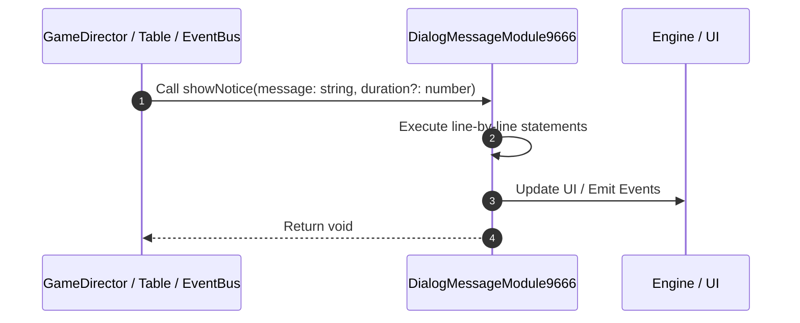

# 📖 `DialogMessageModule9666.showNotice()`

<!-- convention-summary-start -->
### DialogMessageModule9666.showNotice Line-by-Line Method Walkthrough Summary

- **Core Architecture / Purpose**: Technical reference, API contract, and integration guide for DialogMessageModule9666.showNotice Line-by-Line Method Walkthrough.
- **Key Mechanisms & Design**: Encapsulates core algorithms, event hooks, and performance optimizations within the slot framework runtime.
- **Domain Capabilities**: game_implement, 03_methods
- **Scope & Code Paths**: `file:///C:/Users/ADMIN/lamnino/cc20-new-all-in-one/assets/cc-release-slot/cc1-red-cliff/scripts/Gui/DialogMessageModule9666.ts`
- **Related Docs**: [Master Index](../INDEX.md)
<!-- convention-summary-end -->


---

## 1. Method Signature & Overview

```typescript
public showNotice(message: string, duration?: number): void
```

- **Declaring Class**: `DialogMessageModule9666` ([`DialogMessageModule9666.ts`](file:///C:/Users/ADMIN/lamnino/cc20-new-all-in-one/assets/cc-release-slot/cc1-red-cliff/scripts/Gui/DialogMessageModule9666.ts))
- **Source Range**: Lines 47 to 62
- **Execution Cost**: $O(1)$ synchronous logic or timer Promise.

---

## 2. Complete Source Implementation

```typescript
	showNotice(message: string, duration?: number): void {
		if (typeof duration === 'number') {
			this.autoCloseDuration = duration;
		}
		if (this.dialogData) {
			this.dialogData.isOkBtnActive = false;
			this.dialogData.isCancelBtnActive = false;
			this.dialogData.message = message;
			this.dialogData.active = true;
		} else {
			if (this.lbMessage) {
				this.lbMessage.string = message;
			}
			this.showDialog(true);
		}
	}
```

---

## 3. Line-by-Line Code Breakdown

| Line # | Code Snippet | Technical Analysis & Engine Behavior |
| :---: | :--- | :--- |
| **47** | `showNotice(message: string, duration?: number): void {` | Method entry signature declaring `showNotice(message: string, duration?: number)` returning `void`. |
| **48** | `if (typeof duration === 'number') {` | Conditional guard evaluating branching prerequisite. |
| **49** | `this.autoCloseDuration = duration;` | Executes core logic. |
| **50** | `}` | Scope boundary closing block. |
| **51** | `if (this.dialogData) {` | Conditional guard evaluating branching prerequisite. |
| **52** | `this.dialogData.isOkBtnActive = false;` | Executes core logic. |
| **53** | `this.dialogData.isCancelBtnActive = false;` | Executes core logic. |
| **54** | `this.dialogData.message = message;` | Executes core logic. |
| **55** | `this.dialogData.active = true;` | Executes core logic. |
| **56** | `} else {` | Executes core logic. |
| **57** | `if (this.lbMessage) {` | Conditional guard evaluating branching prerequisite. |
| **58** | `this.lbMessage.string = message;` | Mutates label text content. |
| **59** | `}` | Scope boundary closing block. |
| **60** | `this.showDialog(true);` | Executes core logic. |
| **61** | `}` | Scope boundary closing block. |
| **62** | `}` | Scope boundary closing block. |

---

## 4. Execution Call Graph & Sequence


