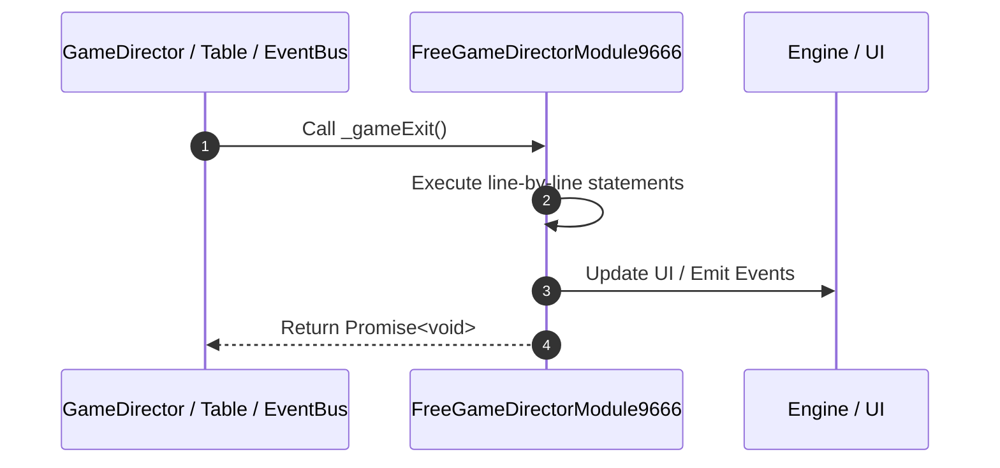

# 📖 `FreeGameDirectorModule9666._gameExit()`

<!-- convention-summary-start -->
### FreeGameDirectorModule9666._gameExit Line-by-Line Method Walkthrough Summary

- **Core Architecture / Purpose**: Technical reference, API contract, and integration guide for FreeGameDirectorModule9666._gameExit Line-by-Line Method Walkthrough.
- **Key Mechanisms & Design**: Encapsulates core algorithms, event hooks, and performance optimizations within the slot framework runtime.
- **Domain Capabilities**: game_implement, 03_methods
- **Scope & Code Paths**: `file:///C:/Users/ADMIN/lamnino/cc20-new-all-in-one/assets/cc-release-slot/cc1-red-cliff/scripts/GameMode/FreeGameDirectorModule9666.ts`
- **Related Docs**: [Master Index](../INDEX.md)
<!-- convention-summary-end -->


---

## 1. Method Signature & Overview

```typescript
public _gameExit(): Promise<void>
```

- **Declaring Class**: `FreeGameDirectorModule9666` ([`FreeGameDirectorModule9666.ts`](file:///C:/Users/ADMIN/lamnino/cc20-new-all-in-one/assets/cc-release-slot/cc1-red-cliff/scripts/GameMode/FreeGameDirectorModule9666.ts))
- **Source Range**: Lines 97 to 101
- **Execution Cost**: $O(1)$ synchronous logic or timer Promise.

---

## 2. Complete Source Implementation

```typescript
	override async _gameExit(): Promise<void> {
		await super._gameExit();
		this.eventManager.emit('RESET_MULTIPLIER', false);
		this.eventManager.emit('RESET_SCATTER_COUNT');
	}
```

---

## 3. Line-by-Line Code Breakdown

| Line # | Code Snippet | Technical Analysis & Engine Behavior |
| :---: | :--- | :--- |
| **97** | `override async _gameExit(): Promise<void> {` | Method entry signature declaring `_gameExit()` returning `Promise<void>`. |
| **98** | `await super._gameExit();` | Delegates to parent superclass lifecycle implementation. |
| **99** | `this.eventManager.emit('RESET_MULTIPLIER', false);` | Dispatches event `RESET_MULTIPLIER` to subscribers. |
| **100** | `this.eventManager.emit('RESET_SCATTER_COUNT');` | Dispatches event `RESET_SCATTER_COUNT` to subscribers. |
| **101** | `}` | Scope boundary closing block. |

---

## 4. Execution Call Graph & Sequence


