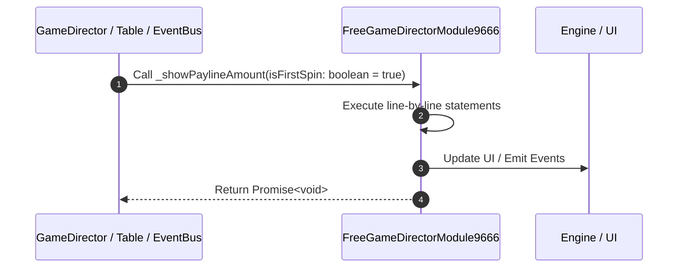

# 📖 `FreeGameDirectorModule9666._showPaylineAmount()`

<!-- convention-summary-start -->
### FreeGameDirectorModule9666._showPaylineAmount Line-by-Line Method Walkthrough Summary

- **Core Architecture / Purpose**: Technical reference, API contract, and integration guide for FreeGameDirectorModule9666._showPaylineAmount Line-by-Line Method Walkthrough.
- **Key Mechanisms & Design**: Encapsulates core algorithms, event hooks, and performance optimizations within the slot framework runtime.
- **Domain Capabilities**: game_implement, 03_methods
- **Scope & Code Paths**: `file:///C:/Users/ADMIN/lamnino/cc20-new-all-in-one/assets/cc-release-slot/cc1-red-cliff/scripts/GameMode/FreeGameDirectorModule9666.ts`
- **Related Docs**: [Master Index](../INDEX.md)
<!-- convention-summary-end -->


---

## 1. Method Signature & Overview

```typescript
public _showPaylineAmount(isFirstSpin: boolean = true): Promise<void>
```

- **Declaring Class**: `FreeGameDirectorModule9666` ([`FreeGameDirectorModule9666.ts`](file:///C:/Users/ADMIN/lamnino/cc20-new-all-in-one/assets/cc-release-slot/cc1-red-cliff/scripts/GameMode/FreeGameDirectorModule9666.ts))
- **Source Range**: Lines 127 to 129
- **Execution Cost**: $O(1)$ synchronous logic or timer Promise.

---

## 2. Complete Source Implementation

```typescript
	private _showPaylineAmount(isFirstSpin: boolean = true): Promise<void> {
		return this.eventManager.emit('SHOW_PAYLINE_WIN_AMOUNT', { isFirstSpin });
	}
```

---

## 3. Line-by-Line Code Breakdown

| Line # | Code Snippet | Technical Analysis & Engine Behavior |
| :---: | :--- | :--- |
| **127** | `private _showPaylineAmount(isFirstSpin: boolean = true): Promise<void> {` | Method entry signature declaring `_showPaylineAmount(isFirstSpin: boolean = true)` returning `Promise<void>`. |
| **128** | `return this.eventManager.emit('SHOW_PAYLINE_WIN_AMOUNT', { isFirstSpin });` | Returns value or promise to calling sequence. |
| **129** | `}` | Scope boundary closing block. |

---

## 4. Execution Call Graph & Sequence


