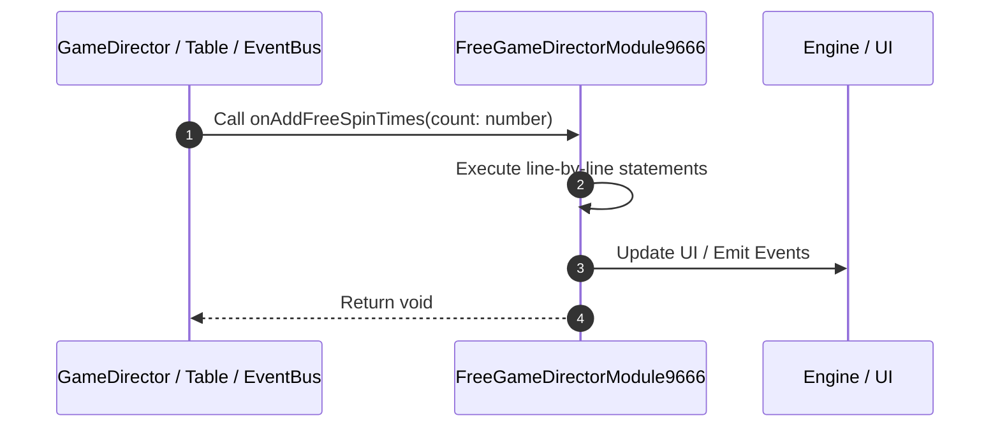

# 📖 `FreeGameDirectorModule9666.onAddFreeSpinTimes()`

<!-- convention-summary-start -->
### FreeGameDirectorModule9666.onAddFreeSpinTimes Line-by-Line Method Walkthrough Summary

- **Core Architecture / Purpose**: Technical reference, API contract, and integration guide for FreeGameDirectorModule9666.onAddFreeSpinTimes Line-by-Line Method Walkthrough.
- **Key Mechanisms & Design**: Encapsulates core algorithms, event hooks, and performance optimizations within the slot framework runtime.
- **Domain Capabilities**: game_implement, 03_methods
- **Scope & Code Paths**: `file:///C:/Users/ADMIN/lamnino/cc20-new-all-in-one/assets/cc-release-slot/cc1-red-cliff/scripts/GameMode/FreeGameDirectorModule9666.ts`
- **Related Docs**: [Master Index](../INDEX.md)
<!-- convention-summary-end -->


---

## 1. Method Signature & Overview

```typescript
public onAddFreeSpinTimes(count: number): void
```

- **Declaring Class**: `FreeGameDirectorModule9666` ([`FreeGameDirectorModule9666.ts`](file:///C:/Users/ADMIN/lamnino/cc20-new-all-in-one/assets/cc-release-slot/cc1-red-cliff/scripts/GameMode/FreeGameDirectorModule9666.ts))
- **Source Range**: Lines 50 to 56
- **Execution Cost**: $O(1)$ synchronous logic or timer Promise.

---

## 2. Complete Source Implementation

```typescript
	private onAddFreeSpinTimes(count: number): void {
		const spinTimesModule = this.spinTimes?.getComponent(SpinTimesModule);
		const currentShown = spinTimesModule ? (parseInt(spinTimesModule.spinTimesLabel.string, 10) || 0) : this.dataStore.freeSpinTimes;
		const newTotal = currentShown + count;
		this.dataStore.freeSpinTimes = newTotal;
		this._updateSpinTimes(newTotal);
	}
```

---

## 3. Line-by-Line Code Breakdown

| Line # | Code Snippet | Technical Analysis & Engine Behavior |
| :---: | :--- | :--- |
| **50** | `private onAddFreeSpinTimes(count: number): void {` | Method entry signature declaring `onAddFreeSpinTimes(count: number)` returning `void`. |
| **51** | `const spinTimesModule = this.spinTimes?.getComponent(SpinTimesModule);` | Allocates local variable `spinTimesModule`. |
| **52** | `const currentShown = spinTimesModule ? (parseInt(spinTimesModule.spinTimesLabel.string, 10) \|\| 0) : this.dataStore.freeSpinTimes;` | Allocates local variable `currentShown`. |
| **53** | `const newTotal = currentShown + count;` | Allocates local variable `newTotal`. |
| **54** | `this.dataStore.freeSpinTimes = newTotal;` | Executes core logic. |
| **55** | `this._updateSpinTimes(newTotal);` | Executes core logic. |
| **56** | `}` | Scope boundary closing block. |

---

## 4. Execution Call Graph & Sequence


