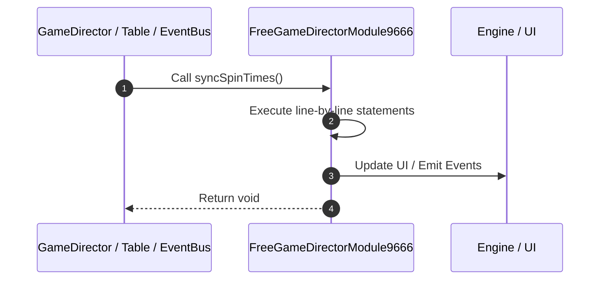

# 📖 `FreeGameDirectorModule9666.syncSpinTimes()`

<!-- convention-summary-start -->
### FreeGameDirectorModule9666.syncSpinTimes Line-by-Line Method Walkthrough Summary

- **Core Architecture / Purpose**: Technical reference, API contract, and integration guide for FreeGameDirectorModule9666.syncSpinTimes Line-by-Line Method Walkthrough.
- **Key Mechanisms & Design**: Encapsulates core algorithms, event hooks, and performance optimizations within the slot framework runtime.
- **Domain Capabilities**: game_implement, 03_methods
- **Scope & Code Paths**: `file:///C:/Users/ADMIN/lamnino/cc20-new-all-in-one/assets/cc-release-slot/cc1-red-cliff/scripts/GameMode/FreeGameDirectorModule9666.ts`
- **Related Docs**: [Master Index](../INDEX.md)
<!-- convention-summary-end -->


---

## 1. Method Signature & Overview

```typescript
public syncSpinTimes(): void
```

- **Declaring Class**: `FreeGameDirectorModule9666` ([`FreeGameDirectorModule9666.ts`](file:///C:/Users/ADMIN/lamnino/cc20-new-all-in-one/assets/cc-release-slot/cc1-red-cliff/scripts/GameMode/FreeGameDirectorModule9666.ts))
- **Source Range**: Lines 14 to 32
- **Execution Cost**: $O(1)$ synchronous logic or timer Promise.

---

## 2. Complete Source Implementation

```typescript
	override syncSpinTimes(): void {
		const { freeGameRemain, freeGame, isResume } = this.dataStore.playSession;
		let total = freeGameRemain || freeGame || 0;

		if (isResume) {
			const rawMatrix: string[] = this.dataStore.playSession.respinGameMatrix
				|| this.dataStore.playSession.freeGameMatrix
				|| this.dataStore.playSession.matrix
				|| this.dataStore.playSession.fMx0
				|| this.dataStore.playSession.matrix0
				|| [];
			const SCATTER_SYMBOL = 'A';
			const scatterCount = rawMatrix.filter((symbol) => symbol === SCATTER_SYMBOL).length;
			total = Math.max(0, total - scatterCount);
		}

		this.dataStore.freeSpinTimes = total;
		this.spinTimes.emit("UPDATE_SPINTIMES", this.dataStore.freeSpinTimes);
	}
```

---

## 3. Line-by-Line Code Breakdown

| Line # | Code Snippet | Technical Analysis & Engine Behavior |
| :---: | :--- | :--- |
| **14** | `override syncSpinTimes(): void {` | Method entry signature declaring `syncSpinTimes()` returning `void`. |
| **15** | `const { freeGameRemain, freeGame, isResume } = this.dataStore.playSession;` | Allocates local variable `{ freeGameRemain, freeGame, isResume }`. |
| **16** | `let total = freeGameRemain \|\| freeGame \|\| 0;` | Allocates local variable `total`. |
| **17** | `` | Executes core logic. |
| **18** | `if (isResume) {` | Conditional guard evaluating branching prerequisite. |
| **19** | `const rawMatrix: string[] = this.dataStore.playSession.respinGameMatrix` | Allocates local variable `rawMatrix: string[]`. |
| **20** | `\|\| this.dataStore.playSession.freeGameMatrix` | Executes core logic. |
| **21** | `\|\| this.dataStore.playSession.matrix` | Executes core logic. |
| **22** | `\|\| this.dataStore.playSession.fMx0` | Executes core logic. |
| **23** | `\|\| this.dataStore.playSession.matrix0` | Executes core logic. |
| **24** | `\|\| [];` | Executes core logic. |
| **25** | `const SCATTER_SYMBOL = 'A';` | Allocates local variable `SCATTER_SYMBOL`. |
| **26** | `const scatterCount = rawMatrix.filter((symbol) => symbol === SCATTER_SYMBOL).length;` | Allocates local variable `scatterCount`. |
| **27** | `total = Math.max(0, total - scatterCount);` | Executes core logic. |
| **28** | `}` | Scope boundary closing block. |
| **29** | `` | Executes core logic. |
| **30** | `this.dataStore.freeSpinTimes = total;` | Executes core logic. |
| **31** | `this.spinTimes.emit("UPDATE_SPINTIMES", this.dataStore.freeSpinTimes);` | Executes core logic. |
| **32** | `}` | Scope boundary closing block. |

---

## 4. Execution Call Graph & Sequence


