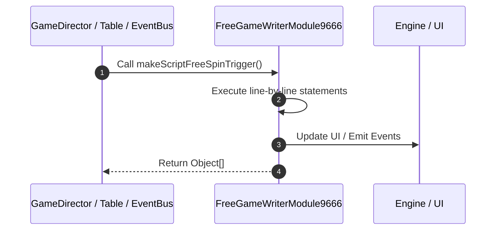

# 📖 `FreeGameWriterModule9666.makeScriptFreeSpinTrigger()`

<!-- convention-summary-start -->
### FreeGameWriterModule9666.makeScriptFreeSpinTrigger Line-by-Line Method Walkthrough Summary

- **Core Architecture / Purpose**: Technical reference, API contract, and integration guide for FreeGameWriterModule9666.makeScriptFreeSpinTrigger Line-by-Line Method Walkthrough.
- **Key Mechanisms & Design**: Encapsulates core algorithms, event hooks, and performance optimizations within the slot framework runtime.
- **Domain Capabilities**: game_implement, 03_methods
- **Scope & Code Paths**: `file:///C:/Users/ADMIN/lamnino/cc20-new-all-in-one/assets/cc-release-slot/cc1-red-cliff/scripts/GameMode/FreeGameWriterModule9666.ts`
- **Related Docs**: [Master Index](../INDEX.md)
<!-- convention-summary-end -->


---

## 1. Method Signature & Overview

```typescript
public makeScriptFreeSpinTrigger(): Object[]
```

- **Declaring Class**: `FreeGameWriterModule9666` ([`FreeGameWriterModule9666.ts`](file:///C:/Users/ADMIN/lamnino/cc20-new-all-in-one/assets/cc-release-slot/cc1-red-cliff/scripts/GameMode/FreeGameWriterModule9666.ts))
- **Source Range**: Lines 30 to 51
- **Execution Cost**: $O(1)$ synchronous logic or timer Promise.

---

## 2. Complete Source Implementation

```typescript
	makeScriptFreeSpinTrigger(): Object[] {
		let listScript = [];
		listScript.push({
			command: "_beforeSpinStart",
		});
		listScript.push({
			command: "_syncPlaySessionData",
		});
		listScript.push({
			command: "_resetOnSpin",
		});
		listScript.push({
			command: "_resetTable",
		});
		listScript.push({
			command: "_decreaseFreeGameSpinTimes",
		});
		listScript.push({
			command: "_resetMultiplier",
		});
		return listScript;
	}
```

---

## 3. Line-by-Line Code Breakdown

| Line # | Code Snippet | Technical Analysis & Engine Behavior |
| :---: | :--- | :--- |
| **30** | `makeScriptFreeSpinTrigger(): Object[] {` | Method entry signature declaring `makeScriptFreeSpinTrigger()` returning `Object[]`. |
| **31** | `let listScript = [];` | Allocates local variable `listScript`. |
| **32** | `listScript.push({` | Executes core logic. |
| **33** | `command: "_beforeSpinStart",` | Executes core logic. |
| **34** | `});` | Executes core logic. |
| **35** | `listScript.push({` | Executes core logic. |
| **36** | `command: "_syncPlaySessionData",` | Executes core logic. |
| **37** | `});` | Executes core logic. |
| **38** | `listScript.push({` | Executes core logic. |
| **39** | `command: "_resetOnSpin",` | Executes core logic. |
| **40** | `});` | Executes core logic. |
| **41** | `listScript.push({` | Executes core logic. |
| **42** | `command: "_resetTable",` | Executes core logic. |
| **43** | `});` | Executes core logic. |
| **44** | `listScript.push({` | Executes core logic. |
| **45** | `command: "_decreaseFreeGameSpinTimes",` | Executes core logic. |
| **46** | `});` | Executes core logic. |
| **47** | `listScript.push({` | Executes core logic. |
| **48** | `command: "_resetMultiplier",` | Executes core logic. |
| **49** | `});` | Executes core logic. |
| **50** | `return listScript;` | Returns value or promise to calling sequence. |
| **51** | `}` | Scope boundary closing block. |

---

## 4. Execution Call Graph & Sequence


