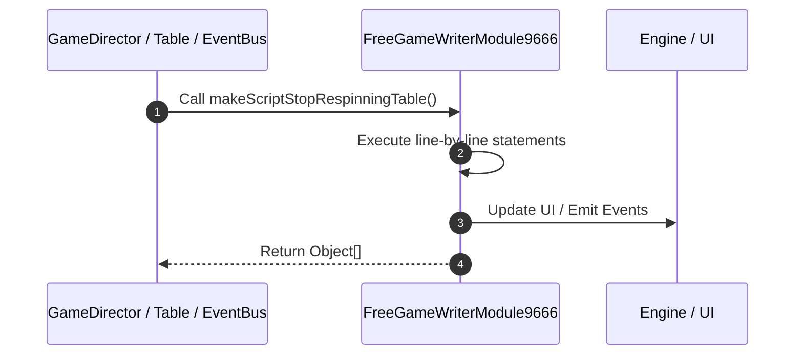

# 📖 `FreeGameWriterModule9666.makeScriptStopRespinningTable()`

<!-- convention-summary-start -->
### FreeGameWriterModule9666.makeScriptStopRespinningTable Line-by-Line Method Walkthrough Summary

- **Core Architecture / Purpose**: Technical reference, API contract, and integration guide for FreeGameWriterModule9666.makeScriptStopRespinningTable Line-by-Line Method Walkthrough.
- **Key Mechanisms & Design**: Encapsulates core algorithms, event hooks, and performance optimizations within the slot framework runtime.
- **Domain Capabilities**: game_implement, 03_methods
- **Scope & Code Paths**: `file:///C:/Users/ADMIN/lamnino/cc20-new-all-in-one/assets/cc-release-slot/cc1-red-cliff/scripts/GameMode/FreeGameWriterModule9666.ts`
- **Related Docs**: [Master Index](../INDEX.md)
<!-- convention-summary-end -->


---

## 1. Method Signature & Overview

```typescript
public makeScriptStopRespinningTable(): Object[]
```

- **Declaring Class**: `FreeGameWriterModule9666` ([`FreeGameWriterModule9666.ts`](file:///C:/Users/ADMIN/lamnino/cc20-new-all-in-one/assets/cc-release-slot/cc1-red-cliff/scripts/GameMode/FreeGameWriterModule9666.ts))
- **Source Range**: Lines 73 to 94
- **Execution Cost**: $O(1)$ synchronous logic or timer Promise.

---

## 2. Complete Source Implementation

```typescript
	makeScriptStopRespinningTable(): Object[] {
		let listScript = [];
		listScript.push({
			command: "_showRespinResultEntry",
		});
		listScript.push({
			command: "_stopRespinningTable",
		});
		listScript.push({
			command: "_syncStackWild",
		});
		listScript.push({
			command: "_collectWildMultiplier",
		});
		listScript.push({
			command: "_setUpPaylines",
		});
		listScript.push({
			command: "_showRespinResultFinal",
		});
		return listScript;
	}
```

---

## 3. Line-by-Line Code Breakdown

| Line # | Code Snippet | Technical Analysis & Engine Behavior |
| :---: | :--- | :--- |
| **73** | `makeScriptStopRespinningTable(): Object[] {` | Method entry signature declaring `makeScriptStopRespinningTable()` returning `Object[]`. |
| **74** | `let listScript = [];` | Allocates local variable `listScript`. |
| **75** | `listScript.push({` | Executes core logic. |
| **76** | `command: "_showRespinResultEntry",` | Executes core logic. |
| **77** | `});` | Executes core logic. |
| **78** | `listScript.push({` | Executes core logic. |
| **79** | `command: "_stopRespinningTable",` | Executes core logic. |
| **80** | `});` | Executes core logic. |
| **81** | `listScript.push({` | Executes core logic. |
| **82** | `command: "_syncStackWild",` | Executes core logic. |
| **83** | `});` | Executes core logic. |
| **84** | `listScript.push({` | Executes core logic. |
| **85** | `command: "_collectWildMultiplier",` | Executes core logic. |
| **86** | `});` | Executes core logic. |
| **87** | `listScript.push({` | Executes core logic. |
| **88** | `command: "_setUpPaylines",` | Executes core logic. |
| **89** | `});` | Executes core logic. |
| **90** | `listScript.push({` | Executes core logic. |
| **91** | `command: "_showRespinResultFinal",` | Executes core logic. |
| **92** | `});` | Executes core logic. |
| **93** | `return listScript;` | Returns value or promise to calling sequence. |
| **94** | `}` | Scope boundary closing block. |

---

## 4. Execution Call Graph & Sequence


