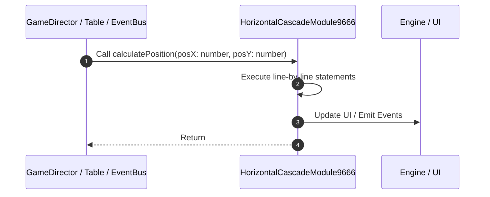

# 📖 `HorizontalCascadeModule9666.calculatePosition()`

<!-- convention-summary-start -->
### HorizontalCascadeModule9666.calculatePosition Line-by-Line Method Walkthrough Summary

- **Core Architecture / Purpose**: Technical reference, API contract, and integration guide for HorizontalCascadeModule9666.calculatePosition Line-by-Line Method Walkthrough.
- **Key Mechanisms & Design**: Encapsulates core algorithms, event hooks, and performance optimizations within the slot framework runtime.
- **Domain Capabilities**: game_implement, 03_methods
- **Scope & Code Paths**: `file:///C:/Users/ADMIN/lamnino/cc20-new-all-in-one/assets/cc-release-slot/cc1-red-cliff/scripts/Table/HorizontalCascadeModule9666.ts`
- **Related Docs**: [Master Index](../INDEX.md)
<!-- convention-summary-end -->


---

## 1. Method Signature & Overview

```typescript
public calculatePosition(posX: number, posY: number): 
```

- **Declaring Class**: `HorizontalCascadeModule9666` ([`HorizontalCascadeModule9666.ts`](file:///C:/Users/ADMIN/lamnino/cc20-new-all-in-one/assets/cc-release-slot/cc1-red-cliff/scripts/Table/HorizontalCascadeModule9666.ts))
- **Source Range**: Lines 69 to 75
- **Execution Cost**: $O(1)$ synchronous logic or timer Promise.

---

## 2. Complete Source Implementation

```typescript
	protected calculatePosition(posX: number, posY: number): { targetPos: cc.Vec2, targetBouncePos: cc.Vec2 } {
		const targetPos = new cc.Vec2(posX, posY);
		const DELTA_BOUNCING = 0;
		const targetBouncePos = new cc.Vec2(posX + DELTA_BOUNCING, posY);

		return { targetPos, targetBouncePos };
	}
```

---

## 3. Line-by-Line Code Breakdown

| Line # | Code Snippet | Technical Analysis & Engine Behavior |
| :---: | :--- | :--- |
| **69** | `protected calculatePosition(posX: number, posY: number): { targetPos: cc.Vec2, targetBouncePos: cc.Vec2 } {` | Method entry signature declaring `calculatePosition(posX: number, posY: number)` returning ``. |
| **70** | `const targetPos = new cc.Vec2(posX, posY);` | Allocates local variable `targetPos`. |
| **71** | `const DELTA_BOUNCING = 0;` | Allocates local variable `DELTA_BOUNCING`. |
| **72** | `const targetBouncePos = new cc.Vec2(posX + DELTA_BOUNCING, posY);` | Allocates local variable `targetBouncePos`. |
| **73** | `` | Executes core logic. |
| **74** | `return { targetPos, targetBouncePos };` | Returns value or promise to calling sequence. |
| **75** | `}` | Scope boundary closing block. |

---

## 4. Execution Call Graph & Sequence


