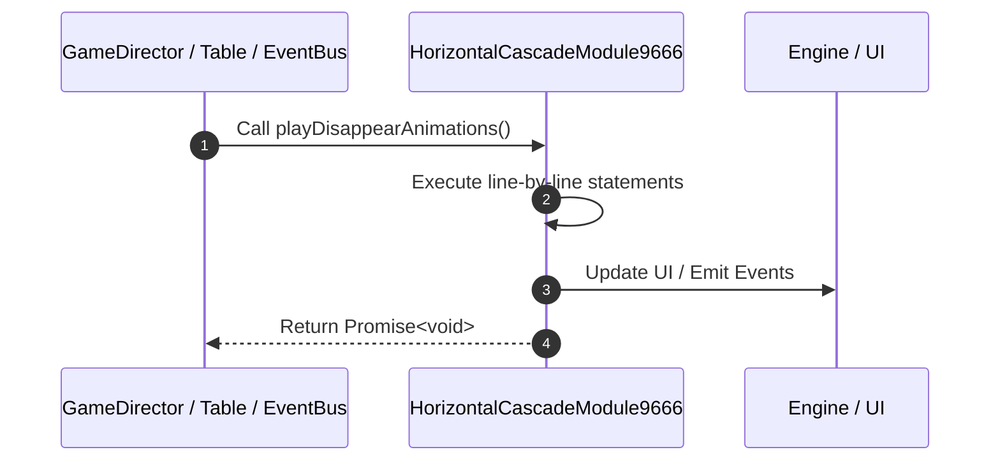

# 📖 `HorizontalCascadeModule9666.playDisappearAnimations()`

<!-- convention-summary-start -->
### HorizontalCascadeModule9666.playDisappearAnimations Line-by-Line Method Walkthrough Summary

- **Core Architecture / Purpose**: Technical reference, API contract, and integration guide for HorizontalCascadeModule9666.playDisappearAnimations Line-by-Line Method Walkthrough.
- **Key Mechanisms & Design**: Encapsulates core algorithms, event hooks, and performance optimizations within the slot framework runtime.
- **Domain Capabilities**: game_implement, 03_methods
- **Scope & Code Paths**: `file:///C:/Users/ADMIN/lamnino/cc20-new-all-in-one/assets/cc-release-slot/cc1-red-cliff/scripts/Table/HorizontalCascadeModule9666.ts`
- **Related Docs**: [Master Index](../INDEX.md)
<!-- convention-summary-end -->


---

## 1. Method Signature & Overview

```typescript
public playDisappearAnimations(): Promise<void>
```

- **Declaring Class**: `HorizontalCascadeModule9666` ([`HorizontalCascadeModule9666.ts`](file:///C:/Users/ADMIN/lamnino/cc20-new-all-in-one/assets/cc-release-slot/cc1-red-cliff/scripts/Table/HorizontalCascadeModule9666.ts))
- **Source Range**: Lines 41 to 67
- **Execution Cost**: $O(1)$ synchronous logic or timer Promise.

---

## 2. Complete Source Implementation

```typescript
	protected async playDisappearAnimations(): Promise<void> {
		let hasDropSymbol = false;
		for (let i = 0; i < this.listDropColumns.length; i++) {
			const col = this.listDropColumns[i];
			let row = this.listSymbols[i].length - 1;
			for (let j = this.listTraceWay[col].length - 1; j >= 0; j--) {
				const value = this.listTraceWay[col][j];
				const { code, size } = this.mapSymbolData(value);
				if (code == this.config.DROP_SYMBOL_CODE) {
					const symbol = this.listSymbols[i][row];
					if (symbol) {
						symbol.emit('PLAY_ANIMATION_DISAPPEAR');
						hasDropSymbol = true;
					}
				}
				row = row - size;
			}
		}

		if (hasDropSymbol) {
			await new Promise<void>((resolve) => {
				this.scheduleOnce(() => {
					resolve();
				}, 0.45 / this.speed);
			});
		}
	}
```

---

## 3. Line-by-Line Code Breakdown

| Line # | Code Snippet | Technical Analysis & Engine Behavior |
| :---: | :--- | :--- |
| **41** | `protected async playDisappearAnimations(): Promise<void> {` | Method entry signature declaring `playDisappearAnimations()` returning `Promise<void>`. |
| **42** | `let hasDropSymbol = false;` | Allocates local variable `hasDropSymbol`. |
| **43** | `for (let i = 0; i < this.listDropColumns.length; i++) {` | Executes core logic. |
| **44** | `const col = this.listDropColumns[i];` | Allocates local variable `col`. |
| **45** | `let row = this.listSymbols[i].length - 1;` | Allocates local variable `row`. |
| **46** | `for (let j = this.listTraceWay[col].length - 1; j >= 0; j--) {` | Executes core logic. |
| **47** | `const value = this.listTraceWay[col][j];` | Allocates local variable `value`. |
| **48** | `const { code, size } = this.mapSymbolData(value);` | Allocates local variable `{ code, size }`. |
| **49** | `if (code == this.config.DROP_SYMBOL_CODE) {` | Conditional guard evaluating branching prerequisite. |
| **50** | `const symbol = this.listSymbols[i][row];` | Allocates local variable `symbol`. |
| **51** | `if (symbol) {` | Conditional guard evaluating branching prerequisite. |
| **52** | `symbol.emit('PLAY_ANIMATION_DISAPPEAR');` | Executes core logic. |
| **53** | `hasDropSymbol = true;` | Executes core logic. |
| **54** | `}` | Scope boundary closing block. |
| **55** | `}` | Scope boundary closing block. |
| **56** | `row = row - size;` | Executes core logic. |
| **57** | `}` | Scope boundary closing block. |
| **58** | `}` | Scope boundary closing block. |
| **59** | `` | Executes core logic. |
| **60** | `if (hasDropSymbol) {` | Conditional guard evaluating branching prerequisite. |
| **61** | `await new Promise<void>((resolve) => {` | Executes core logic. |
| **62** | `this.scheduleOnce(() => {` | Schedules timed asynchronous callback. |
| **63** | `resolve();` | Executes core logic. |
| **64** | `}, 0.45 / this.speed);` | Executes core logic. |
| **65** | `});` | Executes core logic. |
| **66** | `}` | Scope boundary closing block. |
| **67** | `}` | Scope boundary closing block. |

---

## 4. Execution Call Graph & Sequence


