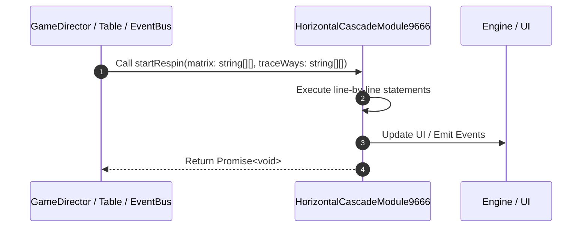

# 📖 `HorizontalCascadeModule9666.startRespin()`

<!-- convention-summary-start -->
### HorizontalCascadeModule9666.startRespin Line-by-Line Method Walkthrough Summary

- **Core Architecture / Purpose**: Technical reference, API contract, and integration guide for HorizontalCascadeModule9666.startRespin Line-by-Line Method Walkthrough.
- **Key Mechanisms & Design**: Encapsulates core algorithms, event hooks, and performance optimizations within the slot framework runtime.
- **Domain Capabilities**: game_implement, 03_methods
- **Scope & Code Paths**: `file:///C:/Users/ADMIN/lamnino/cc20-new-all-in-one/assets/cc-release-slot/cc1-red-cliff/scripts/Table/HorizontalCascadeModule9666.ts`
- **Related Docs**: [Master Index](../INDEX.md)
<!-- convention-summary-end -->


---

## 1. Method Signature & Overview

```typescript
public startRespin(matrix: string[][], traceWays: string[][]): Promise<void>
```

- **Declaring Class**: `HorizontalCascadeModule9666` ([`HorizontalCascadeModule9666.ts`](file:///C:/Users/ADMIN/lamnino/cc20-new-all-in-one/assets/cc-release-slot/cc1-red-cliff/scripts/Table/HorizontalCascadeModule9666.ts))
- **Source Range**: Lines 14 to 39
- **Execution Cost**: $O(1)$ synchronous logic or timer Promise.

---

## 2. Complete Source Implementation

```typescript
	async startRespin(matrix: string[][], traceWays: string[][]): Promise<void> {
		this.clearSymbols();
		if (!matrix && !traceWays) {
			const cascadeData = this.getComponent(HorizontalCascadeData);
			const { horizonMatrix, listTraceWay } = cascadeData.formatData();
			this.matrix = horizonMatrix;
			this.listTraceWay = listTraceWay;
		} else {
			this.matrix = matrix;
			this.listTraceWay = traceWays;
		}

		this.listDroppedSymbols = [];
		this.listNewSymbols = [];

		this.checkForDropSymbols();
		this.resetSymbolList();
		this.updateSymbolList();

		await this.playDisappearAnimations();

		this.removeDroppedSymbols();

		this._hasStartRespin = true;
		this._hasRespinCompleted = false;
	}
```

---

## 3. Line-by-Line Code Breakdown

| Line # | Code Snippet | Technical Analysis & Engine Behavior |
| :---: | :--- | :--- |
| **14** | `async startRespin(matrix: string[][], traceWays: string[][]): Promise<void> {` | Method entry signature declaring `startRespin(matrix: string[][], traceWays: string[][])` returning `Promise<void>`. |
| **15** | `this.clearSymbols();` | Executes core logic. |
| **16** | `if (!matrix && !traceWays) {` | Conditional guard evaluating branching prerequisite. |
| **17** | `const cascadeData = this.getComponent(HorizontalCascadeData);` | Allocates local variable `cascadeData`. |
| **18** | `const { horizonMatrix, listTraceWay } = cascadeData.formatData();` | Allocates local variable `{ horizonMatrix, listTraceWay }`. |
| **19** | `this.matrix = horizonMatrix;` | Executes core logic. |
| **20** | `this.listTraceWay = listTraceWay;` | Executes core logic. |
| **21** | `} else {` | Executes core logic. |
| **22** | `this.matrix = matrix;` | Executes core logic. |
| **23** | `this.listTraceWay = traceWays;` | Executes core logic. |
| **24** | `}` | Scope boundary closing block. |
| **25** | `` | Executes core logic. |
| **26** | `this.listDroppedSymbols = [];` | Executes core logic. |
| **27** | `this.listNewSymbols = [];` | Executes core logic. |
| **28** | `` | Executes core logic. |
| **29** | `this.checkForDropSymbols();` | Executes core logic. |
| **30** | `this.resetSymbolList();` | Executes core logic. |
| **31** | `this.updateSymbolList();` | Executes core logic. |
| **32** | `` | Executes core logic. |
| **33** | `await this.playDisappearAnimations();` | Executes core logic. |
| **34** | `` | Executes core logic. |
| **35** | `this.removeDroppedSymbols();` | Executes core logic. |
| **36** | `` | Executes core logic. |
| **37** | `this._hasStartRespin = true;` | Executes core logic. |
| **38** | `this._hasRespinCompleted = false;` | Executes core logic. |
| **39** | `}` | Scope boundary closing block. |

---

## 4. Execution Call Graph & Sequence


