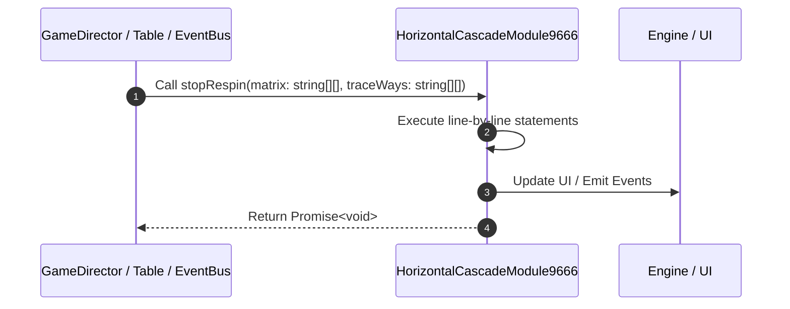

# 📖 `HorizontalCascadeModule9666.stopRespin()`

<!-- convention-summary-start -->
### HorizontalCascadeModule9666.stopRespin Line-by-Line Method Walkthrough Summary

- **Core Architecture / Purpose**: Technical reference, API contract, and integration guide for HorizontalCascadeModule9666.stopRespin Line-by-Line Method Walkthrough.
- **Key Mechanisms & Design**: Encapsulates core algorithms, event hooks, and performance optimizations within the slot framework runtime.
- **Domain Capabilities**: game_implement, 03_methods
- **Scope & Code Paths**: `file:///C:/Users/ADMIN/lamnino/cc20-new-all-in-one/assets/cc-release-slot/cc1-red-cliff/scripts/Table/HorizontalCascadeModule9666.ts`
- **Related Docs**: [Master Index](../INDEX.md)
<!-- convention-summary-end -->


---

## 1. Method Signature & Overview

```typescript
public stopRespin(matrix: string[][], traceWays: string[][]): Promise<void>
```

- **Declaring Class**: `HorizontalCascadeModule9666` ([`HorizontalCascadeModule9666.ts`](file:///C:/Users/ADMIN/lamnino/cc20-new-all-in-one/assets/cc-release-slot/cc1-red-cliff/scripts/Table/HorizontalCascadeModule9666.ts))
- **Source Range**: Lines 77 to 114
- **Execution Cost**: $O(1)$ synchronous logic or timer Promise.

---

## 2. Complete Source Implementation

```typescript
	public stopRespin(matrix: string[][], traceWays: string[][]): Promise<void> {
		let tw: string[][] = null;
		if (!matrix && !traceWays) {
			const cascadeData = this.getComponent(HorizontalCascadeData);
			const { horizonMatrix, listTraceWay } = cascadeData.formatData();
			this.matrix = horizonMatrix;
			tw = listTraceWay;
		} else {
			this.matrix = matrix;
			tw = traceWays;
		}

		this.preparingSymbols();
		this.droppingSymbols();

		this._respinCB = () => {
			this.listSymbols = [];
			this.listTraceWay = tw;
			if (this.symbolManager && this.symbolManager.usingSymbols) {
				this.symbolManager.usingSymbols.forEach((symbolNode) => {
					if (cc.isValid(symbolNode)) {
						symbolNode.emit('PLAY_ANIMATION_IDLE');
					}
				});
			}
			this._stopRespinCB && this._stopRespinCB();
			this._stopRespinCB = null;
			this._respinCB = null;
		};

		this.scheduleOnce(this._respinCB, this.config.CASCADING_TIME_COMPLETED);
		this._hasStartRespin = false;
		this._hasRespinCompleted = true;

		return new Promise((resolve) => {
			this._stopRespinCB = resolve;
		});
	}
```

---

## 3. Line-by-Line Code Breakdown

| Line # | Code Snippet | Technical Analysis & Engine Behavior |
| :---: | :--- | :--- |
| **77** | `public stopRespin(matrix: string[][], traceWays: string[][]): Promise<void> {` | Method entry signature declaring `stopRespin(matrix: string[][], traceWays: string[][])` returning `Promise<void>`. |
| **78** | `let tw: string[][] = null;` | Allocates local variable `tw: string[][]`. |
| **79** | `if (!matrix && !traceWays) {` | Conditional guard evaluating branching prerequisite. |
| **80** | `const cascadeData = this.getComponent(HorizontalCascadeData);` | Allocates local variable `cascadeData`. |
| **81** | `const { horizonMatrix, listTraceWay } = cascadeData.formatData();` | Allocates local variable `{ horizonMatrix, listTraceWay }`. |
| **82** | `this.matrix = horizonMatrix;` | Executes core logic. |
| **83** | `tw = listTraceWay;` | Executes core logic. |
| **84** | `} else {` | Executes core logic. |
| **85** | `this.matrix = matrix;` | Executes core logic. |
| **86** | `tw = traceWays;` | Executes core logic. |
| **87** | `}` | Scope boundary closing block. |
| **88** | `` | Executes core logic. |
| **89** | `this.preparingSymbols();` | Executes core logic. |
| **90** | `this.droppingSymbols();` | Executes core logic. |
| **91** | `` | Executes core logic. |
| **92** | `this._respinCB = () => {` | Executes core logic. |
| **93** | `this.listSymbols = [];` | Executes core logic. |
| **94** | `this.listTraceWay = tw;` | Executes core logic. |
| **95** | `if (this.symbolManager && this.symbolManager.usingSymbols) {` | Conditional guard evaluating branching prerequisite. |
| **96** | `this.symbolManager.usingSymbols.forEach((symbolNode) => {` | Executes core logic. |
| **97** | `if (cc.isValid(symbolNode)) {` | Conditional guard evaluating branching prerequisite. |
| **98** | `symbolNode.emit('PLAY_ANIMATION_IDLE');` | Executes core logic. |
| **99** | `}` | Scope boundary closing block. |
| **100** | `});` | Executes core logic. |
| **101** | `}` | Scope boundary closing block. |
| **102** | `this._stopRespinCB && this._stopRespinCB();` | Executes core logic. |
| **103** | `this._stopRespinCB = null;` | Executes core logic. |
| **104** | `this._respinCB = null;` | Executes core logic. |
| **105** | `};` | Executes core logic. |
| **106** | `` | Executes core logic. |
| **107** | `this.scheduleOnce(this._respinCB, this.config.CASCADING_TIME_COMPLETED);` | Schedules timed asynchronous callback. |
| **108** | `this._hasStartRespin = false;` | Executes core logic. |
| **109** | `this._hasRespinCompleted = true;` | Executes core logic. |
| **110** | `` | Executes core logic. |
| **111** | `return new Promise((resolve) => {` | Returns value or promise to calling sequence. |
| **112** | `this._stopRespinCB = resolve;` | Executes core logic. |
| **113** | `});` | Executes core logic. |
| **114** | `}` | Scope boundary closing block. |

---

## 4. Execution Call Graph & Sequence


