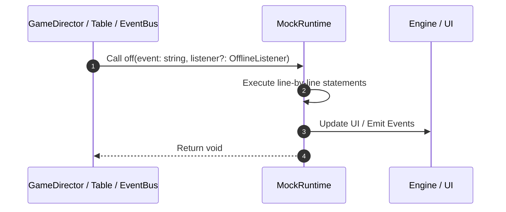

# 📖 `MockRuntime.off()`

<!-- convention-summary-start -->
### MockRuntime.off Line-by-Line Method Walkthrough Summary

- **Core Architecture / Purpose**: Technical reference, API contract, and integration guide for MockRuntime.off Line-by-Line Method Walkthrough.
- **Key Mechanisms & Design**: Encapsulates core algorithms, event hooks, and performance optimizations within the slot framework runtime.
- **Domain Capabilities**: game_implement, 03_methods
- **Scope & Code Paths**: `file:///C:/Users/ADMIN/lamnino/cc20-new-all-in-one/assets/cc-release-slot/cc1-red-cliff/scripts/Mock/Framework/MockRuntime.ts`
- **Related Docs**: [Master Index](../INDEX.md)
<!-- convention-summary-end -->


---

## 1. Method Signature & Overview

```typescript
public off(event: string, listener?: OfflineListener): void
```

- **Declaring Class**: `MockRuntime` ([`MockRuntime.ts`](file:///C:/Users/ADMIN/lamnino/cc20-new-all-in-one/assets/cc-release-slot/cc1-red-cliff/scripts/Mock/Framework/MockRuntime.ts))
- **Source Range**: Lines 20 to 26
- **Execution Cost**: $O(1)$ synchronous logic or timer Promise.

---

## 2. Complete Source Implementation

```typescript
	off(event: string, listener?: OfflineListener): void {
		if (!listener) {
			this.listeners.delete(event);
			return;
		}
		this.listeners.get(event)?.delete(listener);
	}
```

---

## 3. Line-by-Line Code Breakdown

| Line # | Code Snippet | Technical Analysis & Engine Behavior |
| :---: | :--- | :--- |
| **20** | `off(event: string, listener?: OfflineListener): void {` | Method entry signature declaring `off(event: string, listener?: OfflineListener)` returning `void`. |
| **21** | `if (!listener) {` | Conditional guard evaluating branching prerequisite. |
| **22** | `this.listeners.delete(event);` | Executes core logic. |
| **23** | `return;` | Returns value or promise to calling sequence. |
| **24** | `}` | Scope boundary closing block. |
| **25** | `this.listeners.get(event)?.delete(listener);` | Executes core logic. |
| **26** | `}` | Scope boundary closing block. |

---

## 4. Execution Call Graph & Sequence


