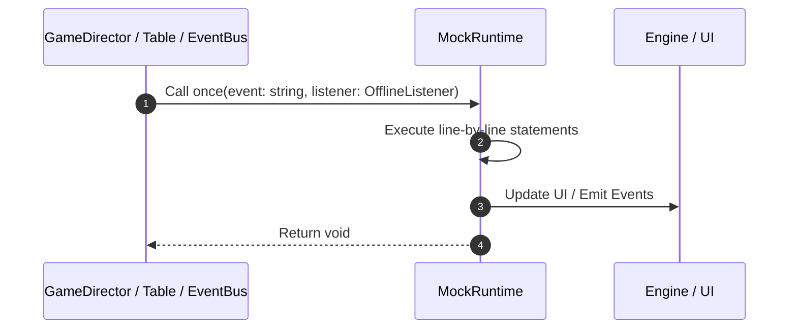

# 📖 `MockRuntime.once()`

<!-- convention-summary-start -->
### MockRuntime.once Line-by-Line Method Walkthrough Summary

- **Core Architecture / Purpose**: Technical reference, API contract, and integration guide for MockRuntime.once Line-by-Line Method Walkthrough.
- **Key Mechanisms & Design**: Encapsulates core algorithms, event hooks, and performance optimizations within the slot framework runtime.
- **Domain Capabilities**: game_implement, 03_methods
- **Scope & Code Paths**: `file:///C:/Users/ADMIN/lamnino/cc20-new-all-in-one/assets/cc-release-slot/cc1-red-cliff/scripts/Mock/Framework/MockRuntime.ts`
- **Related Docs**: [Master Index](../INDEX.md)
<!-- convention-summary-end -->


---

## 1. Method Signature & Overview

```typescript
public once(event: string, listener: OfflineListener): void
```

- **Declaring Class**: `MockRuntime` ([`MockRuntime.ts`](file:///C:/Users/ADMIN/lamnino/cc20-new-all-in-one/assets/cc-release-slot/cc1-red-cliff/scripts/Mock/Framework/MockRuntime.ts))
- **Source Range**: Lines 12 to 18
- **Execution Cost**: $O(1)$ synchronous logic or timer Promise.

---

## 2. Complete Source Implementation

```typescript
	once(event: string, listener: OfflineListener): void {
		const wrapped = (...args: any[]) => {
			this.off(event, wrapped);
			listener(...args);
		};
		this.on(event, wrapped);
	}
```

---

## 3. Line-by-Line Code Breakdown

| Line # | Code Snippet | Technical Analysis & Engine Behavior |
| :---: | :--- | :--- |
| **12** | `once(event: string, listener: OfflineListener): void {` | Method entry signature declaring `once(event: string, listener: OfflineListener)` returning `void`. |
| **13** | `const wrapped = (...args: any[]) => {` | Allocates local variable `wrapped`. |
| **14** | `this.off(event, wrapped);` | Executes core logic. |
| **15** | `listener(...args);` | Executes core logic. |
| **16** | `};` | Executes core logic. |
| **17** | `this.on(event, wrapped);` | Executes core logic. |
| **18** | `}` | Scope boundary closing block. |

---

## 4. Execution Call Graph & Sequence


