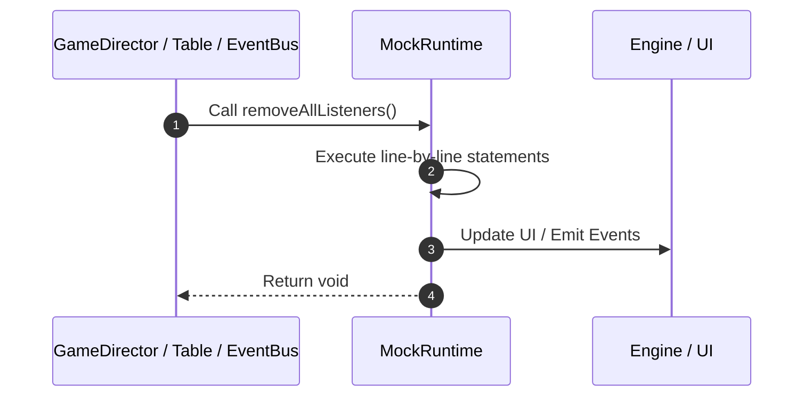

# 📖 `MockRuntime.removeAllListeners()`

<!-- convention-summary-start -->
### MockRuntime.removeAllListeners Line-by-Line Method Walkthrough Summary

- **Core Architecture / Purpose**: Technical reference, API contract, and integration guide for MockRuntime.removeAllListeners Line-by-Line Method Walkthrough.
- **Key Mechanisms & Design**: Encapsulates core algorithms, event hooks, and performance optimizations within the slot framework runtime.
- **Domain Capabilities**: game_implement, 03_methods
- **Scope & Code Paths**: `file:///C:/Users/ADMIN/lamnino/cc20-new-all-in-one/assets/cc-release-slot/cc1-red-cliff/scripts/Mock/Framework/MockRuntime.ts`
- **Related Docs**: [Master Index](../INDEX.md)
<!-- convention-summary-end -->


---

## 1. Method Signature & Overview

```typescript
public removeAllListeners(): void
```

- **Declaring Class**: `MockRuntime` ([`MockRuntime.ts`](file:///C:/Users/ADMIN/lamnino/cc20-new-all-in-one/assets/cc-release-slot/cc1-red-cliff/scripts/Mock/Framework/MockRuntime.ts))
- **Source Range**: Lines 32 to 34
- **Execution Cost**: $O(1)$ synchronous logic or timer Promise.

---

## 2. Complete Source Implementation

```typescript
	removeAllListeners(): void {
		this.listeners.clear();
	}
```

---

## 3. Line-by-Line Code Breakdown

| Line # | Code Snippet | Technical Analysis & Engine Behavior |
| :---: | :--- | :--- |
| **32** | `removeAllListeners(): void {` | Method entry signature declaring `removeAllListeners()` returning `void`. |
| **33** | `this.listeners.clear();` | Executes core logic. |
| **34** | `}` | Scope boundary closing block. |

---

## 4. Execution Call Graph & Sequence


