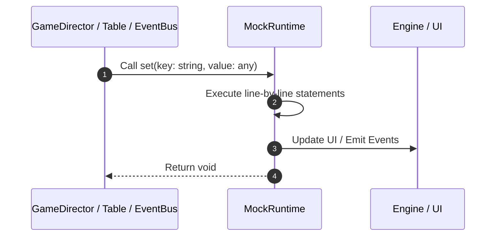

# 📖 `MockRuntime.set()`

<!-- convention-summary-start -->
### MockRuntime.set Line-by-Line Method Walkthrough Summary

- **Core Architecture / Purpose**: Technical reference, API contract, and integration guide for MockRuntime.set Line-by-Line Method Walkthrough.
- **Key Mechanisms & Design**: Encapsulates core algorithms, event hooks, and performance optimizations within the slot framework runtime.
- **Domain Capabilities**: game_implement, 03_methods
- **Scope & Code Paths**: `file:///C:/Users/ADMIN/lamnino/cc20-new-all-in-one/assets/cc-release-slot/cc1-red-cliff/scripts/Mock/Framework/MockRuntime.ts`
- **Related Docs**: [Master Index](../INDEX.md)
<!-- convention-summary-end -->


---

## 1. Method Signature & Overview

```typescript
public set(key: string, value: any): void
```

- **Declaring Class**: `MockRuntime` ([`MockRuntime.ts`](file:///C:/Users/ADMIN/lamnino/cc20-new-all-in-one/assets/cc-release-slot/cc1-red-cliff/scripts/Mock/Framework/MockRuntime.ts))
- **Source Range**: Lines 44 to 53
- **Execution Cost**: $O(1)$ synchronous logic or timer Promise.

---

## 2. Complete Source Implementation

```typescript
	set(key: string, value: any): void { this.store[key] = value; }
	get(key: string): any { return this.store[key]; }
	remove(key: string): void { delete this.store[key]; }
	delete(key: string): void { this.remove(key); }
	has(key: string): boolean { return Object.prototype.hasOwnProperty.call(this.store, key); }
	clear(): void { this.store = {}; }
	count(): number { return Object.keys(this.store).length; }
	keys(): string[] { return Object.keys(this.store); }
	values(): any[] { return Object.keys(this.store).map((key) => this.store[key]); }
}
```

---

## 3. Line-by-Line Code Breakdown

| Line # | Code Snippet | Technical Analysis & Engine Behavior |
| :---: | :--- | :--- |
| **44** | `set(key: string, value: any): void { this.store[key] = value; }` | Method entry signature declaring `set(key: string, value: any)` returning `void`. |
| **45** | `get(key: string): any { return this.store[key]; }` | Executes core logic. |
| **46** | `remove(key: string): void { delete this.store[key]; }` | Executes core logic. |
| **47** | `delete(key: string): void { this.remove(key); }` | Executes core logic. |
| **48** | `has(key: string): boolean { return Object.prototype.hasOwnProperty.call(this.store, key); }` | Executes core logic. |
| **49** | `clear(): void { this.store = {}; }` | Executes core logic. |
| **50** | `count(): number { return Object.keys(this.store).length; }` | Executes core logic. |
| **51** | `keys(): string[] { return Object.keys(this.store); }` | Executes core logic. |
| **52** | `values(): any[] { return Object.keys(this.store).map((key) => this.store[key]); }` | Executes core logic. |
| **53** | `}` | Scope boundary closing block. |

---

## 4. Execution Call Graph & Sequence


