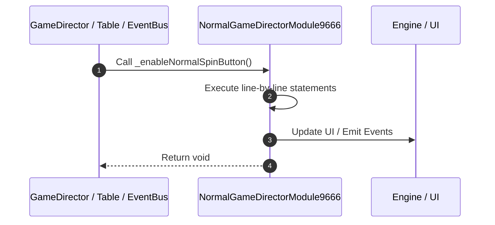

# 📖 `NormalGameDirectorModule9666._enableNormalSpinButton()`

<!-- convention-summary-start -->
### NormalGameDirectorModule9666._enableNormalSpinButton Line-by-Line Method Walkthrough Summary

- **Core Architecture / Purpose**: Technical reference, API contract, and integration guide for NormalGameDirectorModule9666._enableNormalSpinButton Line-by-Line Method Walkthrough.
- **Key Mechanisms & Design**: Encapsulates core algorithms, event hooks, and performance optimizations within the slot framework runtime.
- **Domain Capabilities**: game_implement, 03_methods
- **Scope & Code Paths**: `file:///C:/Users/ADMIN/lamnino/cc20-new-all-in-one/assets/cc-release-slot/cc1-red-cliff/scripts/GameMode/NormalGameDirectorModule9666.ts`
- **Related Docs**: [Master Index](../INDEX.md)
<!-- convention-summary-end -->


---

## 1. Method Signature & Overview

```typescript
public _enableNormalSpinButton(): void
```

- **Declaring Class**: `NormalGameDirectorModule9666` ([`NormalGameDirectorModule9666.ts`](file:///C:/Users/ADMIN/lamnino/cc20-new-all-in-one/assets/cc-release-slot/cc1-red-cliff/scripts/GameMode/NormalGameDirectorModule9666.ts))
- **Source Range**: Lines 185 to 196
- **Execution Cost**: $O(1)$ synchronous logic or timer Promise.

---

## 2. Complete Source Implementation

```typescript
	protected _enableNormalSpinButton(): void {
		if (this.slotButton) {
			const buttons = this.slotButton.getComponentsInChildren(cc.Button);
			buttons.forEach((btn: cc.Button) => {
				btn.interactable = true;
			});
			const slotButtonComp: any = this.slotButton.getComponent('SlotButtonNormal') || this.slotButton.getComponentInChildren('SlotButtonNormal');
			if (slotButtonComp) {
				slotButtonComp._isSwitchingMode = false;
			}
		}
	}
```

---

## 3. Line-by-Line Code Breakdown

| Line # | Code Snippet | Technical Analysis & Engine Behavior |
| :---: | :--- | :--- |
| **185** | `protected _enableNormalSpinButton(): void {` | Method entry signature declaring `_enableNormalSpinButton()` returning `void`. |
| **186** | `if (this.slotButton) {` | Conditional guard evaluating branching prerequisite. |
| **187** | `const buttons = this.slotButton.getComponentsInChildren(cc.Button);` | Allocates local variable `buttons`. |
| **188** | `buttons.forEach((btn: cc.Button) => {` | Executes core logic. |
| **189** | `btn.interactable = true;` | Executes core logic. |
| **190** | `});` | Executes core logic. |
| **191** | `const slotButtonComp: any = this.slotButton.getComponent('SlotButtonNormal') \|\| this.slotButton.getComponentInChildren('SlotButtonNormal');` | Allocates local variable `slotButtonComp: any`. |
| **192** | `if (slotButtonComp) {` | Conditional guard evaluating branching prerequisite. |
| **193** | `slotButtonComp._isSwitchingMode = false;` | Executes core logic. |
| **194** | `}` | Scope boundary closing block. |
| **195** | `}` | Scope boundary closing block. |
| **196** | `}` | Scope boundary closing block. |

---

## 4. Execution Call Graph & Sequence


