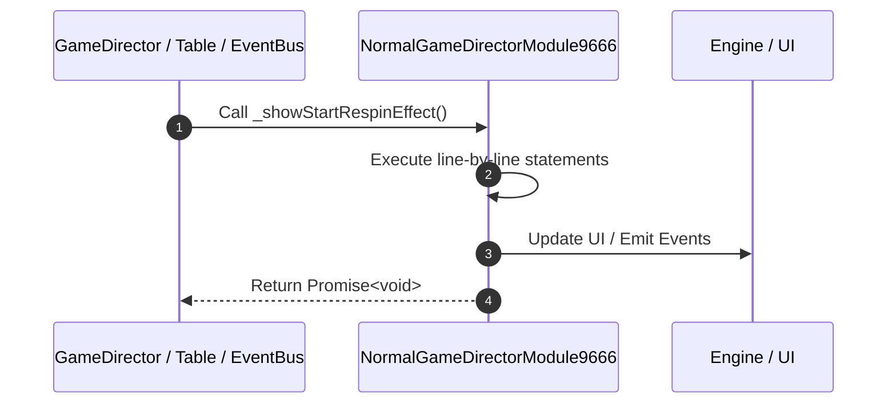

# 📖 `NormalGameDirectorModule9666._showStartRespinEffect()`

<!-- convention-summary-start -->
### NormalGameDirectorModule9666._showStartRespinEffect Line-by-Line Method Walkthrough Summary

- **Core Architecture / Purpose**: Technical reference, API contract, and integration guide for NormalGameDirectorModule9666._showStartRespinEffect Line-by-Line Method Walkthrough.
- **Key Mechanisms & Design**: Encapsulates core algorithms, event hooks, and performance optimizations within the slot framework runtime.
- **Domain Capabilities**: game_implement, 03_methods
- **Scope & Code Paths**: `file:///C:/Users/ADMIN/lamnino/cc20-new-all-in-one/assets/cc-release-slot/cc1-red-cliff/scripts/GameMode/NormalGameDirectorModule9666.ts`
- **Related Docs**: [Master Index](../INDEX.md)
<!-- convention-summary-end -->


---

## 1. Method Signature & Overview

```typescript
public _showStartRespinEffect(): Promise<void>
```

- **Declaring Class**: `NormalGameDirectorModule9666` ([`NormalGameDirectorModule9666.ts`](file:///C:/Users/ADMIN/lamnino/cc20-new-all-in-one/assets/cc-release-slot/cc1-red-cliff/scripts/GameMode/NormalGameDirectorModule9666.ts))
- **Source Range**: Lines 70 to 84
- **Execution Cost**: $O(1)$ synchronous logic or timer Promise.

---

## 2. Complete Source Implementation

```typescript
	async _showStartRespinEffect(): Promise<void> {
		if (this.dataStore.playSession.payLines
			|| this.dataStore.playSession.freeGamePayLines
			|| this.dataStore.playSession.normalGamePayLines) {
			this._blinkAllPaylines();
			this._showPaylineAmount(this.dataStore.playSession.respinGameTotal === 1);
			const speed = (this.gameSettings.isFastToResult || this.gameSettings.isTurboActive) ? 2 : 1;
			await this.delayAction(1 / speed);
			await this.eventManager.emit("APPLY_MULTIPLIER_TO_WIN_AMOUNT", this.dataStore.playSession.respinGameTotal === 1);
			// await this.eventManager.emit('ON_HIDE_PAYLINE_INFO');
			this.eventManager.emit(COMMIT_RESPIN_WIN_AMOUNT);
			await this._clearPaylines();
		}
		return Promise.resolve();
	}
```

---

## 3. Line-by-Line Code Breakdown

| Line # | Code Snippet | Technical Analysis & Engine Behavior |
| :---: | :--- | :--- |
| **70** | `async _showStartRespinEffect(): Promise<void> {` | Method entry signature declaring `_showStartRespinEffect()` returning `Promise<void>`. |
| **71** | `if (this.dataStore.playSession.payLines` | Conditional guard evaluating branching prerequisite. |
| **72** | `\|\| this.dataStore.playSession.freeGamePayLines` | Executes core logic. |
| **73** | `\|\| this.dataStore.playSession.normalGamePayLines) {` | Executes core logic. |
| **74** | `this._blinkAllPaylines();` | Executes core logic. |
| **75** | `this._showPaylineAmount(this.dataStore.playSession.respinGameTotal === 1);` | Executes core logic. |
| **76** | `const speed = (this.gameSettings.isFastToResult \|\| this.gameSettings.isTurboActive) ? 2 : 1;` | Allocates local variable `speed`. |
| **77** | `await this.delayAction(1 / speed);` | Executes core logic. |
| **78** | `await this.eventManager.emit("APPLY_MULTIPLIER_TO_WIN_AMOUNT", this.dataStore.playSession.respinGameTotal === 1);` | Dispatches event `APPLY_MULTIPLIER_TO_WIN_AMOUNT` to subscribers. |
| **79** | `// await this.eventManager.emit('ON_HIDE_PAYLINE_INFO');` | Dispatches event `ON_HIDE_PAYLINE_INFO` to subscribers. |
| **80** | `this.eventManager.emit(COMMIT_RESPIN_WIN_AMOUNT);` | Dispatches event `Event` to subscribers. |
| **81** | `await this._clearPaylines();` | Executes core logic. |
| **82** | `}` | Scope boundary closing block. |
| **83** | `return Promise.resolve();` | Returns value or promise to calling sequence. |
| **84** | `}` | Scope boundary closing block. |

---

## 4. Execution Call Graph & Sequence


