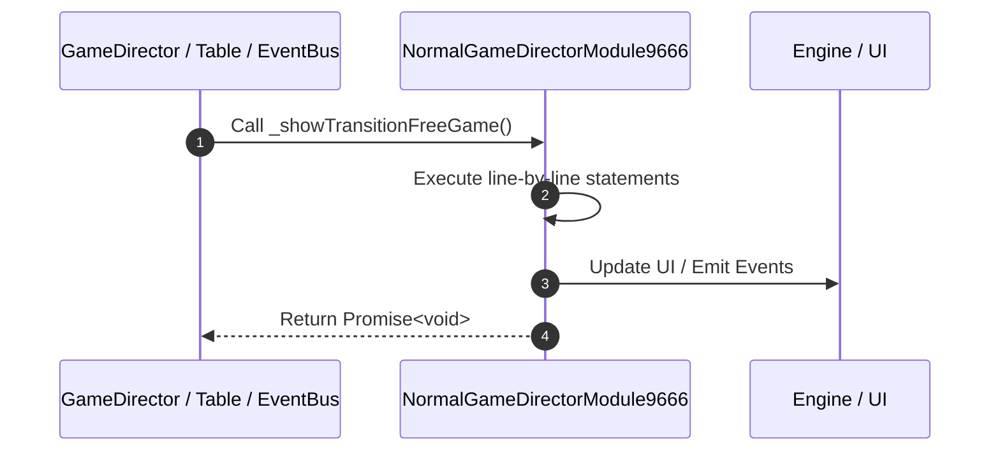

# 📖 `NormalGameDirectorModule9666._showTransitionFreeGame()`

<!-- convention-summary-start -->
### NormalGameDirectorModule9666._showTransitionFreeGame Line-by-Line Method Walkthrough Summary

- **Core Architecture / Purpose**: Technical reference, API contract, and integration guide for NormalGameDirectorModule9666._showTransitionFreeGame Line-by-Line Method Walkthrough.
- **Key Mechanisms & Design**: Encapsulates core algorithms, event hooks, and performance optimizations within the slot framework runtime.
- **Domain Capabilities**: game_implement, 03_methods
- **Scope & Code Paths**: `file:///C:/Users/ADMIN/lamnino/cc20-new-all-in-one/assets/cc-release-slot/cc1-red-cliff/scripts/GameMode/NormalGameDirectorModule9666.ts`
- **Related Docs**: [Master Index](../INDEX.md)
<!-- convention-summary-end -->


---

## 1. Method Signature & Overview

```typescript
public _showTransitionFreeGame(): Promise<void>
```

- **Declaring Class**: `NormalGameDirectorModule9666` ([`NormalGameDirectorModule9666.ts`](file:///C:/Users/ADMIN/lamnino/cc20-new-all-in-one/assets/cc-release-slot/cc1-red-cliff/scripts/GameMode/NormalGameDirectorModule9666.ts))
- **Source Range**: Lines 117 to 122
- **Execution Cost**: $O(1)$ synchronous logic or timer Promise.

---

## 2. Complete Source Implementation

```typescript
	override async _showTransitionFreeGame(): Promise<void> {
		this._disableNormalSpinButton();
		this.eventManager.emit('ON_HIDE_PAYLINE_INFO', true);
		this.eventManager.emit('PLAY_MC_STATE', SpineStateMc9666.TransitionFreespin);
		return super._showTransitionFreeGame();
	}
```

---

## 3. Line-by-Line Code Breakdown

| Line # | Code Snippet | Technical Analysis & Engine Behavior |
| :---: | :--- | :--- |
| **117** | `override async _showTransitionFreeGame(): Promise<void> {` | Method entry signature declaring `_showTransitionFreeGame()` returning `Promise<void>`. |
| **118** | `this._disableNormalSpinButton();` | Executes core logic. |
| **119** | `this.eventManager.emit('ON_HIDE_PAYLINE_INFO', true);` | Dispatches event `ON_HIDE_PAYLINE_INFO` to subscribers. |
| **120** | `this.eventManager.emit('PLAY_MC_STATE', SpineStateMc9666.TransitionFreespin);` | Dispatches event `PLAY_MC_STATE` to subscribers. |
| **121** | `return super._showTransitionFreeGame();` | Returns value or promise to calling sequence. |
| **122** | `}` | Scope boundary closing block. |

---

## 4. Execution Call Graph & Sequence


