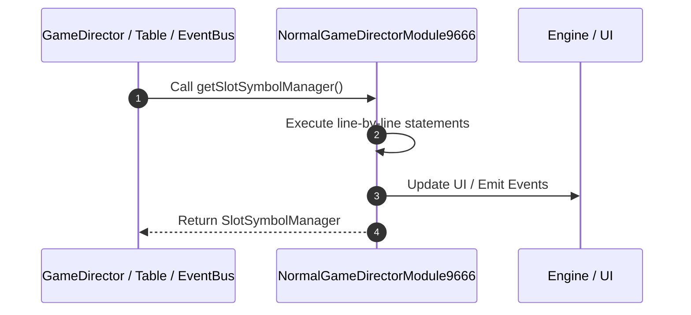

# 📖 `NormalGameDirectorModule9666.getSlotSymbolManager()`

<!-- convention-summary-start -->
### NormalGameDirectorModule9666.getSlotSymbolManager Line-by-Line Method Walkthrough Summary

- **Core Architecture / Purpose**: Technical reference, API contract, and integration guide for NormalGameDirectorModule9666.getSlotSymbolManager Line-by-Line Method Walkthrough.
- **Key Mechanisms & Design**: Encapsulates core algorithms, event hooks, and performance optimizations within the slot framework runtime.
- **Domain Capabilities**: game_implement, 03_methods
- **Scope & Code Paths**: `file:///C:/Users/ADMIN/lamnino/cc20-new-all-in-one/assets/cc-release-slot/cc1-red-cliff/scripts/GameMode/NormalGameDirectorModule9666.ts`
- **Related Docs**: [Master Index](../INDEX.md)
<!-- convention-summary-end -->


---

## 1. Method Signature & Overview

```typescript
public getSlotSymbolManager(): SlotSymbolManager
```

- **Declaring Class**: `NormalGameDirectorModule9666` ([`NormalGameDirectorModule9666.ts`](file:///C:/Users/ADMIN/lamnino/cc20-new-all-in-one/assets/cc-release-slot/cc1-red-cliff/scripts/GameMode/NormalGameDirectorModule9666.ts))
- **Source Range**: Lines 198 to 206
- **Execution Cost**: $O(1)$ synchronous logic or timer Promise.

---

## 2. Complete Source Implementation

```typescript
	protected getSlotSymbolManager(): SlotSymbolManager {
		for (const m of this.moduleList) {
			const slotModule = m.getComponent(SlotSymbolManager);
			if (slotModule) {
				return slotModule;
			}
		}
		return null;
	}
```

---

## 3. Line-by-Line Code Breakdown

| Line # | Code Snippet | Technical Analysis & Engine Behavior |
| :---: | :--- | :--- |
| **198** | `protected getSlotSymbolManager(): SlotSymbolManager {` | Method entry signature declaring `getSlotSymbolManager()` returning `SlotSymbolManager`. |
| **199** | `for (const m of this.moduleList) {` | Executes core logic. |
| **200** | `const slotModule = m.getComponent(SlotSymbolManager);` | Allocates local variable `slotModule`. |
| **201** | `if (slotModule) {` | Conditional guard evaluating branching prerequisite. |
| **202** | `return slotModule;` | Returns value or promise to calling sequence. |
| **203** | `}` | Scope boundary closing block. |
| **204** | `}` | Scope boundary closing block. |
| **205** | `return null;` | Returns value or promise to calling sequence. |
| **206** | `}` | Scope boundary closing block. |

---

## 4. Execution Call Graph & Sequence


