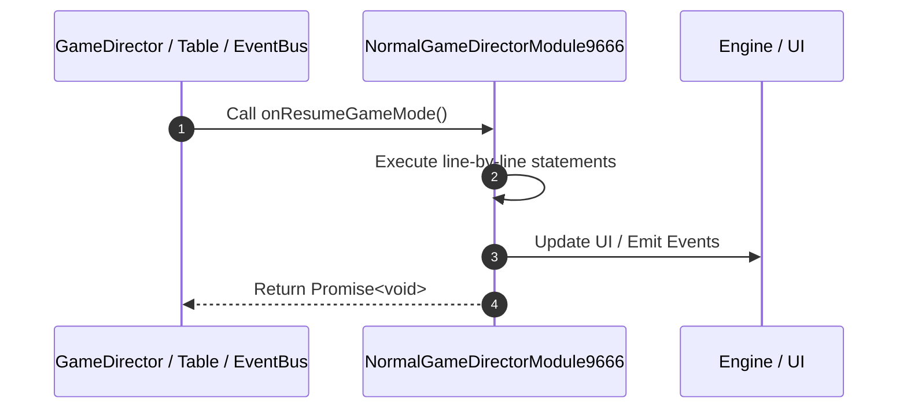

# 📖 `NormalGameDirectorModule9666.onResumeGameMode()`

<!-- convention-summary-start -->
### NormalGameDirectorModule9666.onResumeGameMode Line-by-Line Method Walkthrough Summary

- **Core Architecture / Purpose**: Technical reference, API contract, and integration guide for NormalGameDirectorModule9666.onResumeGameMode Line-by-Line Method Walkthrough.
- **Key Mechanisms & Design**: Encapsulates core algorithms, event hooks, and performance optimizations within the slot framework runtime.
- **Domain Capabilities**: game_implement, 03_methods
- **Scope & Code Paths**: `file:///C:/Users/ADMIN/lamnino/cc20-new-all-in-one/assets/cc-release-slot/cc1-red-cliff/scripts/GameMode/NormalGameDirectorModule9666.ts`
- **Related Docs**: [Master Index](../INDEX.md)
<!-- convention-summary-end -->


---

## 1. Method Signature & Overview

```typescript
public onResumeGameMode(): Promise<void>
```

- **Declaring Class**: `NormalGameDirectorModule9666` ([`NormalGameDirectorModule9666.ts`](file:///C:/Users/ADMIN/lamnino/cc20-new-all-in-one/assets/cc-release-slot/cc1-red-cliff/scripts/GameMode/NormalGameDirectorModule9666.ts))
- **Source Range**: Lines 18 to 21
- **Execution Cost**: $O(1)$ synchronous logic or timer Promise.

---

## 2. Complete Source Implementation

```typescript
	onResumeGameMode(): Promise<void> {
		this._enableNormalSpinButton();
		return this.runAction("ResumeGameMode");
	}
```

---

## 3. Line-by-Line Code Breakdown

| Line # | Code Snippet | Technical Analysis & Engine Behavior |
| :---: | :--- | :--- |
| **18** | `onResumeGameMode(): Promise<void> {` | Method entry signature declaring `onResumeGameMode()` returning `Promise<void>`. |
| **19** | `this._enableNormalSpinButton();` | Executes core logic. |
| **20** | `return this.runAction("ResumeGameMode");` | Returns value or promise to calling sequence. |
| **21** | `}` | Scope boundary closing block. |

---

## 4. Execution Call Graph & Sequence


