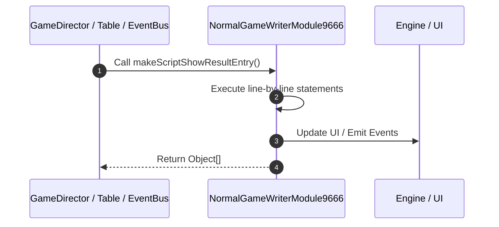

# 📖 `NormalGameWriterModule9666.makeScriptShowResultEntry()`

<!-- convention-summary-start -->
### NormalGameWriterModule9666.makeScriptShowResultEntry Line-by-Line Method Walkthrough Summary

- **Core Architecture / Purpose**: Technical reference, API contract, and integration guide for NormalGameWriterModule9666.makeScriptShowResultEntry Line-by-Line Method Walkthrough.
- **Key Mechanisms & Design**: Encapsulates core algorithms, event hooks, and performance optimizations within the slot framework runtime.
- **Domain Capabilities**: game_implement, 03_methods
- **Scope & Code Paths**: `file:///C:/Users/ADMIN/lamnino/cc20-new-all-in-one/assets/cc-release-slot/cc1-red-cliff/scripts/GameMode/NormalGameWriterModule9666.ts`
- **Related Docs**: [Master Index](../INDEX.md)
<!-- convention-summary-end -->


---

## 1. Method Signature & Overview

```typescript
public makeScriptShowResultEntry(): Object[]
```

- **Declaring Class**: `NormalGameWriterModule9666` ([`NormalGameWriterModule9666.ts`](file:///C:/Users/ADMIN/lamnino/cc20-new-all-in-one/assets/cc-release-slot/cc1-red-cliff/scripts/GameMode/NormalGameWriterModule9666.ts))
- **Source Range**: Lines 95 to 104
- **Execution Cost**: $O(1)$ synchronous logic or timer Promise.

---

## 2. Complete Source Implementation

```typescript
	makeScriptShowResultEntry(): Object[] {
		let listScript = [];
		listScript.push({
			command: "_playJackpotWin",
		});
		listScript.push({
			command: "_showResultEntry",
		});
		return listScript;
	};
```

---

## 3. Line-by-Line Code Breakdown

| Line # | Code Snippet | Technical Analysis & Engine Behavior |
| :---: | :--- | :--- |
| **95** | `makeScriptShowResultEntry(): Object[] {` | Method entry signature declaring `makeScriptShowResultEntry()` returning `Object[]`. |
| **96** | `let listScript = [];` | Allocates local variable `listScript`. |
| **97** | `listScript.push({` | Executes core logic. |
| **98** | `command: "_playJackpotWin",` | Executes core logic. |
| **99** | `});` | Executes core logic. |
| **100** | `listScript.push({` | Executes core logic. |
| **101** | `command: "_showResultEntry",` | Executes core logic. |
| **102** | `});` | Executes core logic. |
| **103** | `return listScript;` | Returns value or promise to calling sequence. |
| **104** | `};` | Executes core logic. |

---

## 4. Execution Call Graph & Sequence


