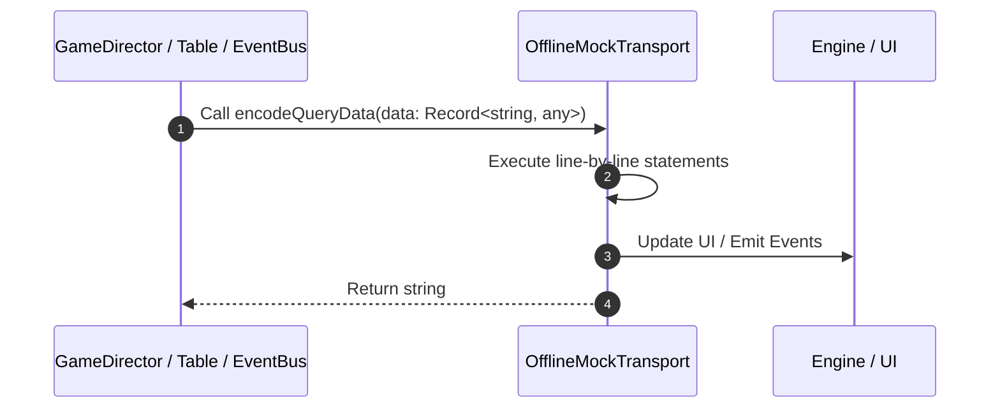

# 📖 `OfflineMockTransport.encodeQueryData()`

<!-- convention-summary-start -->
### OfflineMockTransport.encodeQueryData Line-by-Line Method Walkthrough Summary

- **Core Architecture / Purpose**: Technical reference, API contract, and integration guide for OfflineMockTransport.encodeQueryData Line-by-Line Method Walkthrough.
- **Key Mechanisms & Design**: Encapsulates core algorithms, event hooks, and performance optimizations within the slot framework runtime.
- **Domain Capabilities**: game_implement, 03_methods
- **Scope & Code Paths**: `file:///C:/Users/ADMIN/lamnino/cc20-new-all-in-one/assets/cc-release-slot/cc1-red-cliff/scripts/Mock/Framework/OfflineMockTransport.ts`
- **Related Docs**: [Master Index](../INDEX.md)
<!-- convention-summary-end -->


---

## 1. Method Signature & Overview

```typescript
public encodeQueryData(data: Record<string, any>): string
```

- **Declaring Class**: `OfflineMockTransport` ([`OfflineMockTransport.ts`](file:///C:/Users/ADMIN/lamnino/cc20-new-all-in-one/assets/cc-release-slot/cc1-red-cliff/scripts/Mock/Framework/OfflineMockTransport.ts))
- **Source Range**: Lines 267 to 269
- **Execution Cost**: $O(1)$ synchronous logic or timer Promise.

---

## 2. Complete Source Implementation

```typescript
		encodeQueryData(data: Record<string, any>): string {
			return Object.keys(data || {}).map((key) => `${encodeURIComponent(key)}=${encodeURIComponent(data[key])}`).join("&");
		}
```

---

## 3. Line-by-Line Code Breakdown

| Line # | Code Snippet | Technical Analysis & Engine Behavior |
| :---: | :--- | :--- |
| **267** | `encodeQueryData(data: Record<string, any>): string {` | Method entry signature declaring `encodeQueryData(data: Record<string, any>)` returning `string`. |
| **268** | `return Object.keys(data \|\| {}).map((key) => `${encodeURIComponent(key)}=${encodeURIComponent(data[key])}`).join("&");` | Returns value or promise to calling sequence. |
| **269** | `}` | Scope boundary closing block. |

---

## 4. Execution Call Graph & Sequence


