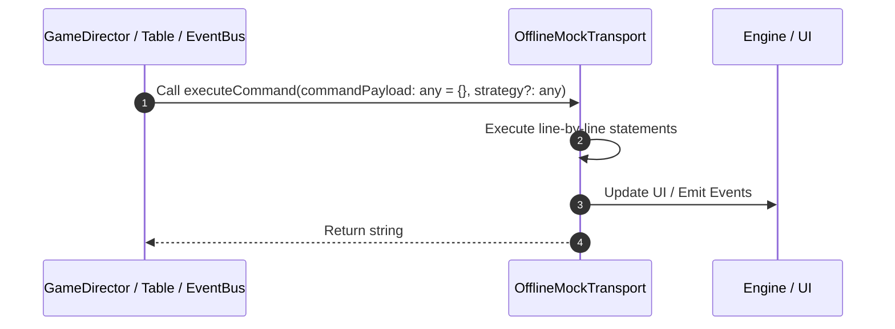

# 📖 `OfflineMockTransport.executeCommand()`

<!-- convention-summary-start -->
### OfflineMockTransport.executeCommand Line-by-Line Method Walkthrough Summary

- **Core Architecture / Purpose**: Technical reference, API contract, and integration guide for OfflineMockTransport.executeCommand Line-by-Line Method Walkthrough.
- **Key Mechanisms & Design**: Encapsulates core algorithms, event hooks, and performance optimizations within the slot framework runtime.
- **Domain Capabilities**: game_implement, 03_methods
- **Scope & Code Paths**: `file:///C:/Users/ADMIN/lamnino/cc20-new-all-in-one/assets/cc-release-slot/cc1-red-cliff/scripts/Mock/Framework/OfflineMockTransport.ts`
- **Related Docs**: [Master Index](../INDEX.md)
<!-- convention-summary-end -->


---

## 1. Method Signature & Overview

```typescript
public executeCommand(commandPayload: any = {}, strategy?: any): string
```

- **Declaring Class**: `OfflineMockTransport` ([`OfflineMockTransport.ts`](file:///C:/Users/ADMIN/lamnino/cc20-new-all-in-one/assets/cc-release-slot/cc1-red-cliff/scripts/Mock/Framework/OfflineMockTransport.ts))
- **Source Range**: Lines 175 to 186
- **Execution Cost**: $O(1)$ synchronous logic or timer Promise.

---

## 2. Complete Source Implementation

```typescript
		executeCommand(commandPayload: any = {}, strategy?: any): string {
			void strategy;
			const event = commandPayload.event || commandPayload.serviceId || this.serviceId;
			const data = commandPayload.data || commandPayload.payload || commandPayload;
			const commandId = getCommandId(context, data);
			data.commandId = commandId;
			data.cId = commandId;
			commandPayload.messageId = commandId;
			this.commandPayloadById[commandId] = { event, data };
			OfflineMessageManager.getInstance().sendMessage(event, data, commandId);
			return commandId;
		}
```

---

## 3. Line-by-Line Code Breakdown

| Line # | Code Snippet | Technical Analysis & Engine Behavior |
| :---: | :--- | :--- |
| **175** | `executeCommand(commandPayload: any = {}, strategy?: any): string {` | Method entry signature declaring `executeCommand(commandPayload: any = {}, strategy?: any)` returning `string`. |
| **176** | `void strategy;` | Executes core logic. |
| **177** | `const event = commandPayload.event \|\| commandPayload.serviceId \|\| this.serviceId;` | Allocates local variable `event`. |
| **178** | `const data = commandPayload.data \|\| commandPayload.payload \|\| commandPayload;` | Allocates local variable `data`. |
| **179** | `const commandId = getCommandId(context, data);` | Allocates local variable `commandId`. |
| **180** | `data.commandId = commandId;` | Executes core logic. |
| **181** | `data.cId = commandId;` | Executes core logic. |
| **182** | `commandPayload.messageId = commandId;` | Executes core logic. |
| **183** | `this.commandPayloadById[commandId] = { event, data };` | Executes core logic. |
| **184** | `OfflineMessageManager.getInstance().sendMessage(event, data, commandId);` | Executes core logic. |
| **185** | `return commandId;` | Returns value or promise to calling sequence. |
| **186** | `}` | Scope boundary closing block. |

---

## 4. Execution Call Graph & Sequence


