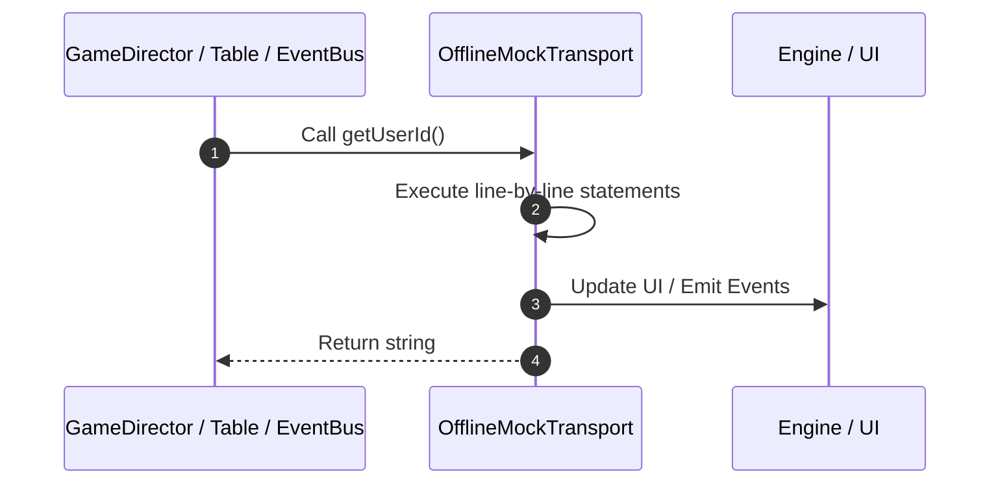

# 📖 `OfflineMockTransport.getUserId()`

<!-- convention-summary-start -->
### OfflineMockTransport.getUserId Line-by-Line Method Walkthrough Summary

- **Core Architecture / Purpose**: Technical reference, API contract, and integration guide for OfflineMockTransport.getUserId Line-by-Line Method Walkthrough.
- **Key Mechanisms & Design**: Encapsulates core algorithms, event hooks, and performance optimizations within the slot framework runtime.
- **Domain Capabilities**: game_implement, 03_methods
- **Scope & Code Paths**: `file:///C:/Users/ADMIN/lamnino/cc20-new-all-in-one/assets/cc-release-slot/cc1-red-cliff/scripts/Mock/Framework/OfflineMockTransport.ts`
- **Related Docs**: [Master Index](../INDEX.md)
<!-- convention-summary-end -->


---

## 1. Method Signature & Overview

```typescript
public getUserId(): string
```

- **Declaring Class**: `OfflineMockTransport` ([`OfflineMockTransport.ts`](file:///C:/Users/ADMIN/lamnino/cc20-new-all-in-one/assets/cc-release-slot/cc1-red-cliff/scripts/Mock/Framework/OfflineMockTransport.ts))
- **Source Range**: Lines 222 to 252
- **Execution Cost**: $O(1)$ synchronous logic or timer Promise.

---

## 2. Complete Source Implementation

```typescript
		getUserId(): string { return this.userId; }
		getUserType(): string { return this.userType; }
		getToken(): string { return this.token; }
		getSSID(): string { return this.ssid; }
		getDisplayName(): string { return this.displayName; }
		getAvatar(): string { return this.avatar; }
		getCurrency(): string { return provider.config?.defaultCurrency || "USD"; }
		getWallets(): any { return { amount: context.walletBalance, pAmount: 0 }; }
		getAllWallet(): any { return { main: { amount: context.walletBalance, availableAmount: context.walletBalance } }; }
		getWalletTypes(): string[] { return ["main"]; }
		getWalletByType(): any { return { amount: context.walletBalance, availableAmount: context.walletBalance }; }
		getWalletBalance(): number { return context.walletBalance; }
		hasMainWalletType(): boolean { return true; }
		hasPromotionWalletType(): boolean { return false; }
		isAnonymousUser(): boolean { return true; }
		isRealUser(): boolean { return false; }
		setToken(token: string): void { this.token = token; }
		setUserId(userId: string): void { this.userId = userId; }
		setUserType(userType: string): void { this.userType = userType; }
		setDisplayName(displayName: string): void { this.displayName = displayName; }
		setAvatar(avatar: string): void { this.avatar = avatar; }
		setCurrency(): void {}
		setWalletInfos(walletInfos: any): void { this.walletInfos = walletInfos; }
		setWalletTypes(): void {}
		setWalletBalance(balance: number): void { context.walletBalance = balance; }
		setWalletBalanceV22(balance: number): void { context.walletBalance = balance; }
		registerEvent(event: string, listener: OfflineListener): void { emitter.on(event, listener); }
		registerEventOnce(event: string, listener: OfflineListener): void { emitter.once(event, listener); }
		removeEvent(event: string, listener?: OfflineListener): void { emitter.off(event, listener); }
		cleanUp(): void {}
	}
```

---

## 3. Line-by-Line Code Breakdown

| Line # | Code Snippet | Technical Analysis & Engine Behavior |
| :---: | :--- | :--- |
| **222** | `getUserId(): string { return this.userId; }` | Method entry signature declaring `getUserId()` returning `string`. |
| **223** | `getUserType(): string { return this.userType; }` | Executes core logic. |
| **224** | `getToken(): string { return this.token; }` | Executes core logic. |
| **225** | `getSSID(): string { return this.ssid; }` | Executes core logic. |
| **226** | `getDisplayName(): string { return this.displayName; }` | Executes core logic. |
| **227** | `getAvatar(): string { return this.avatar; }` | Executes core logic. |
| **228** | `getCurrency(): string { return provider.config?.defaultCurrency \|\| "USD"; }` | Executes core logic. |
| **229** | `getWallets(): any { return { amount: context.walletBalance, pAmount: 0 }; }` | Executes core logic. |
| **230** | `getAllWallet(): any { return { main: { amount: context.walletBalance, availableAmount: context.walletBalance } }; }` | Executes core logic. |
| **231** | `getWalletTypes(): string[] { return ["main"]; }` | Executes core logic. |
| **232** | `getWalletByType(): any { return { amount: context.walletBalance, availableAmount: context.walletBalance }; }` | Executes core logic. |
| **233** | `getWalletBalance(): number { return context.walletBalance; }` | Executes core logic. |
| **234** | `hasMainWalletType(): boolean { return true; }` | Executes core logic. |
| **235** | `hasPromotionWalletType(): boolean { return false; }` | Executes core logic. |
| **236** | `isAnonymousUser(): boolean { return true; }` | Executes core logic. |
| **237** | `isRealUser(): boolean { return false; }` | Executes core logic. |
| **238** | `setToken(token: string): void { this.token = token; }` | Executes core logic. |
| **239** | `setUserId(userId: string): void { this.userId = userId; }` | Executes core logic. |
| **240** | `setUserType(userType: string): void { this.userType = userType; }` | Executes core logic. |
| **241** | `setDisplayName(displayName: string): void { this.displayName = displayName; }` | Executes core logic. |
| **242** | `setAvatar(avatar: string): void { this.avatar = avatar; }` | Executes core logic. |
| **243** | `setCurrency(): void {}` | Executes core logic. |
| **244** | `setWalletInfos(walletInfos: any): void { this.walletInfos = walletInfos; }` | Executes core logic. |
| **245** | `setWalletTypes(): void {}` | Executes core logic. |
| **246** | `setWalletBalance(balance: number): void { context.walletBalance = balance; }` | Executes core logic. |
| **247** | `setWalletBalanceV22(balance: number): void { context.walletBalance = balance; }` | Executes core logic. |
| **248** | `registerEvent(event: string, listener: OfflineListener): void { emitter.on(event, listener); }` | Executes core logic. |
| **249** | `registerEventOnce(event: string, listener: OfflineListener): void { emitter.once(event, listener); }` | Executes core logic. |
| **250** | `removeEvent(event: string, listener?: OfflineListener): void { emitter.off(event, listener); }` | Executes core logic. |
| **251** | `cleanUp(): void {}` | Executes core logic. |
| **252** | `}` | Scope boundary closing block. |

---

## 4. Execution Call Graph & Sequence


