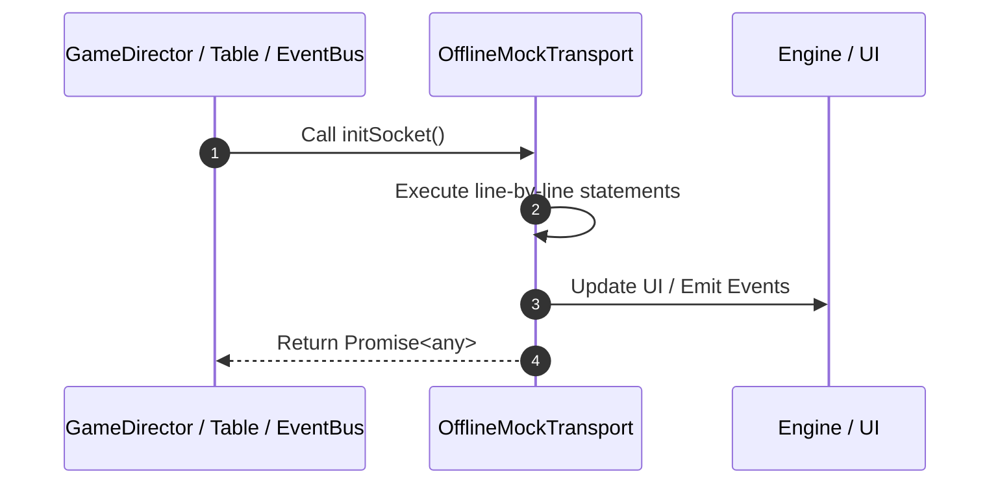

# 📖 `OfflineMockTransport.initSocket()`

<!-- convention-summary-start -->
### OfflineMockTransport.initSocket Line-by-Line Method Walkthrough Summary

- **Core Architecture / Purpose**: Technical reference, API contract, and integration guide for OfflineMockTransport.initSocket Line-by-Line Method Walkthrough.
- **Key Mechanisms & Design**: Encapsulates core algorithms, event hooks, and performance optimizations within the slot framework runtime.
- **Domain Capabilities**: game_implement, 03_methods
- **Scope & Code Paths**: `file:///C:/Users/ADMIN/lamnino/cc20-new-all-in-one/assets/cc-release-slot/cc1-red-cliff/scripts/Mock/Framework/OfflineMockTransport.ts`
- **Related Docs**: [Master Index](../INDEX.md)
<!-- convention-summary-end -->


---

## 1. Method Signature & Overview

```typescript
public initSocket(): Promise<any>
```

- **Declaring Class**: `OfflineMockTransport` ([`OfflineMockTransport.ts`](file:///C:/Users/ADMIN/lamnino/cc20-new-all-in-one/assets/cc-release-slot/cc1-red-cliff/scripts/Mock/Framework/OfflineMockTransport.ts))
- **Source Range**: Lines 140 to 164
- **Execution Cost**: $O(1)$ synchronous logic or timer Promise.

---

## 2. Complete Source Implementation

```typescript
		initSocket(): Promise<any> { return Promise.resolve({ isSuccess: true }); }
		doLogin(): Promise<any> { return Promise.resolve({ isSuccess: true, data: provider.createJoinGameData(context, {}) }); }
		registerEvent(event: string, listener: OfflineListener): void { emitter.on(event, listener); }
		removeEvent(event: string, listener?: OfflineListener): void { emitter.off(event, listener); }
		sendMessage(event: string = "", payload: any = {}, messageId: string = ""): string {
			const responseMessageId = messageId || createMessageId(context);
			emitOfflineResponse(event, payload, responseMessageId);
			return responseMessageId;
		}
		ackMessage(messageId: string): void { this.commandHandlers.onAck?.(messageId); }
		sendChatMessage(): void {}
		subscribe(): void {}
		unSubscribe(): void {}
		registerGame(gameId?: string, commandHandlers: any = {}, socketHandlers: any = {}): void {
			void gameId;
			this.commandHandlers = commandHandlers;
			this.socketHandlers = socketHandlers;
			getTimerHost().setTimeout(() => this.socketHandlers.onConnected?.(), 0);
		}
		unregisterGame(): void {}
		updateToken(): void {}
		addCommandManager(): void {}
		removeSendingMessage(): void {}
		closeAndCleanUp(): void { emitter.removeAllListeners(); }
	}
```

---

## 3. Line-by-Line Code Breakdown

| Line # | Code Snippet | Technical Analysis & Engine Behavior |
| :---: | :--- | :--- |
| **140** | `initSocket(): Promise<any> { return Promise.resolve({ isSuccess: true }); }` | Method entry signature declaring `initSocket()` returning `Promise<any>`. |
| **141** | `doLogin(): Promise<any> { return Promise.resolve({ isSuccess: true, data: provider.createJoinGameData(context, {}) }); }` | Executes core logic. |
| **142** | `registerEvent(event: string, listener: OfflineListener): void { emitter.on(event, listener); }` | Executes core logic. |
| **143** | `removeEvent(event: string, listener?: OfflineListener): void { emitter.off(event, listener); }` | Executes core logic. |
| **144** | `sendMessage(event: string = "", payload: any = {}, messageId: string = ""): string {` | Executes core logic. |
| **145** | `const responseMessageId = messageId \|\| createMessageId(context);` | Allocates local variable `responseMessageId`. |
| **146** | `emitOfflineResponse(event, payload, responseMessageId);` | Executes core logic. |
| **147** | `return responseMessageId;` | Returns value or promise to calling sequence. |
| **148** | `}` | Scope boundary closing block. |
| **149** | `ackMessage(messageId: string): void { this.commandHandlers.onAck?.(messageId); }` | Executes core logic. |
| **150** | `sendChatMessage(): void {}` | Executes core logic. |
| **151** | `subscribe(): void {}` | Executes core logic. |
| **152** | `unSubscribe(): void {}` | Executes core logic. |
| **153** | `registerGame(gameId?: string, commandHandlers: any = {}, socketHandlers: any = {}): void {` | Executes core logic. |
| **154** | `void gameId;` | Executes core logic. |
| **155** | `this.commandHandlers = commandHandlers;` | Executes core logic. |
| **156** | `this.socketHandlers = socketHandlers;` | Executes core logic. |
| **157** | `getTimerHost().setTimeout(() => this.socketHandlers.onConnected?.(), 0);` | Executes core logic. |
| **158** | `}` | Scope boundary closing block. |
| **159** | `unregisterGame(): void {}` | Executes core logic. |
| **160** | `updateToken(): void {}` | Executes core logic. |
| **161** | `addCommandManager(): void {}` | Executes core logic. |
| **162** | `removeSendingMessage(): void {}` | Executes core logic. |
| **163** | `closeAndCleanUp(): void { emitter.removeAllListeners(); }` | Executes core logic. |
| **164** | `}` | Scope boundary closing block. |

---

## 4. Execution Call Graph & Sequence


