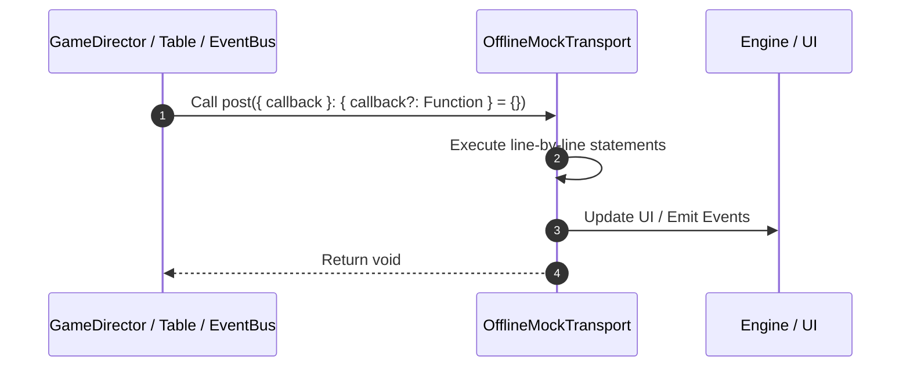

# 📖 `OfflineMockTransport.post()`

<!-- convention-summary-start -->
### OfflineMockTransport.post Line-by-Line Method Walkthrough Summary

- **Core Architecture / Purpose**: Technical reference, API contract, and integration guide for OfflineMockTransport.post Line-by-Line Method Walkthrough.
- **Key Mechanisms & Design**: Encapsulates core algorithms, event hooks, and performance optimizations within the slot framework runtime.
- **Domain Capabilities**: game_implement, 03_methods
- **Scope & Code Paths**: `file:///C:/Users/ADMIN/lamnino/cc20-new-all-in-one/assets/cc-release-slot/cc1-red-cliff/scripts/Mock/Framework/OfflineMockTransport.ts`
- **Related Docs**: [Master Index](../INDEX.md)
<!-- convention-summary-end -->


---

## 1. Method Signature & Overview

```typescript
public post({ callback }: { callback?: Function } = {}): void
```

- **Declaring Class**: `OfflineMockTransport` ([`OfflineMockTransport.ts`](file:///C:/Users/ADMIN/lamnino/cc20-new-all-in-one/assets/cc-release-slot/cc1-red-cliff/scripts/Mock/Framework/OfflineMockTransport.ts))
- **Source Range**: Lines 255 to 257
- **Execution Cost**: $O(1)$ synchronous logic or timer Promise.

---

## 2. Complete Source Implementation

```typescript
		post({ callback }: { callback?: Function } = {}): void {
			callback?.({ status: 200, data: { isSuccess: true, data: provider.createJoinGameData(context, {}) } });
		}
```

---

## 3. Line-by-Line Code Breakdown

| Line # | Code Snippet | Technical Analysis & Engine Behavior |
| :---: | :--- | :--- |
| **255** | `post({ callback }: { callback?: Function } = {}): void {` | Method entry signature declaring `post({ callback }: { callback?: Function } = {})` returning `void`. |
| **256** | `callback?.({ status: 200, data: { isSuccess: true, data: provider.createJoinGameData(context, {}) } });` | Executes core logic. |
| **257** | `}` | Scope boundary closing block. |

---

## 4. Execution Call Graph & Sequence


