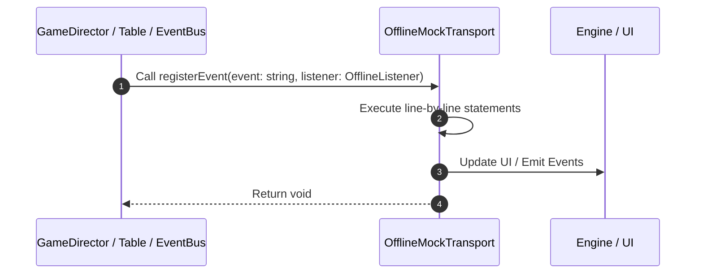

# 📖 `OfflineMockTransport.registerEvent()`

<!-- convention-summary-start -->
### OfflineMockTransport.registerEvent Line-by-Line Method Walkthrough Summary

- **Core Architecture / Purpose**: Technical reference, API contract, and integration guide for OfflineMockTransport.registerEvent Line-by-Line Method Walkthrough.
- **Key Mechanisms & Design**: Encapsulates core algorithms, event hooks, and performance optimizations within the slot framework runtime.
- **Domain Capabilities**: game_implement, 03_methods
- **Scope & Code Paths**: `file:///C:/Users/ADMIN/lamnino/cc20-new-all-in-one/assets/cc-release-slot/cc1-red-cliff/scripts/Mock/Framework/OfflineMockTransport.ts`
- **Related Docs**: [Master Index](../INDEX.md)
<!-- convention-summary-end -->


---

## 1. Method Signature & Overview

```typescript
public registerEvent(event: string, listener: OfflineListener): void
```

- **Declaring Class**: `OfflineMockTransport` ([`OfflineMockTransport.ts`](file:///C:/Users/ADMIN/lamnino/cc20-new-all-in-one/assets/cc-release-slot/cc1-red-cliff/scripts/Mock/Framework/OfflineMockTransport.ts))
- **Source Range**: Lines 283 to 290
- **Execution Cost**: $O(1)$ synchronous logic or timer Promise.

---

## 2. Complete Source Implementation

```typescript
		registerEvent(event: string, listener: OfflineListener): void { emitter.on(event, listener); }
		isSocketAvailable(): boolean { return true; }
		isAbleSendingData(): boolean { return true; }
		sendMessage(packet: any): void {
			emitOfflineResponse(packet?.data?.event || packet?.serviceId || "", packet?.data || packet?.payload || {}, packet?.messageId);
		}
		closeAndCleanUp(): void {}
	}
```

---

## 3. Line-by-Line Code Breakdown

| Line # | Code Snippet | Technical Analysis & Engine Behavior |
| :---: | :--- | :--- |
| **283** | `registerEvent(event: string, listener: OfflineListener): void { emitter.on(event, listener); }` | Method entry signature declaring `registerEvent(event: string, listener: OfflineListener)` returning `void`. |
| **284** | `isSocketAvailable(): boolean { return true; }` | Executes core logic. |
| **285** | `isAbleSendingData(): boolean { return true; }` | Executes core logic. |
| **286** | `sendMessage(packet: any): void {` | Executes core logic. |
| **287** | `emitOfflineResponse(packet?.data?.event \|\| packet?.serviceId \|\| "", packet?.data \|\| packet?.payload \|\| {}, packet?.messageId);` | Executes core logic. |
| **288** | `}` | Scope boundary closing block. |
| **289** | `closeAndCleanUp(): void {}` | Executes core logic. |
| **290** | `}` | Scope boundary closing block. |

---

## 4. Execution Call Graph & Sequence


