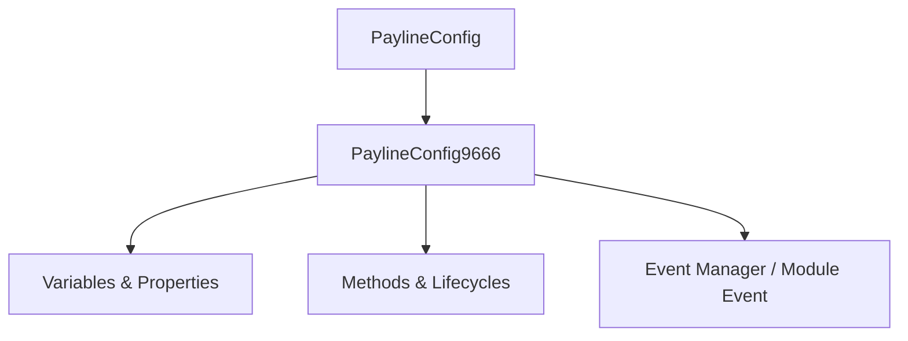

# 🏛️ `PaylineConfig9666` Architecture & Role Specification

<!-- convention-summary-start -->
### PaylineConfig9666 Architecture & Role Specification Summary

- **Core Architecture / Purpose**: Technical reference, API contract, and integration guide for PaylineConfig9666 Architecture & Role Specification.
- **Key Mechanisms & Design**: Encapsulates core algorithms, event hooks, and performance optimizations within the slot framework runtime.
- **Domain Capabilities**: game_implement, 01_overview
- **Scope & Code Paths**: `file:///C:/Users/ADMIN/lamnino/cc20-new-all-in-one/assets/cc-release-slot/cc1-red-cliff/scripts/Payline/PaylineConfig9666.ts`
- **Related Docs**: [Master Index](../INDEX.md)
<!-- convention-summary-end -->

- **Source File**: [`PaylineConfig9666.ts`](file:///C:/Users/ADMIN/lamnino/cc20-new-all-in-one/assets/cc-release-slot/cc1-red-cliff/scripts/Payline/PaylineConfig9666.ts)
- **Class Hierarchy**: `PaylineConfig9666` ➔ `PaylineConfig`
- **Game ID**: `g9666` / `9666` (Red Cliff - Đại Chiến Xích Bích)

---

## 1. Architectural Mission

`PaylineConfig9666` is a specialized runtime component in the **Red Cliff (g9666)** slot engine.

---

## 2. Core Responsibilities

1. **State & Lifecycle Management**:
   - Maintains 0 declared properties and variables with precise state transitions.
2. **Execution & Event Handling**:
   - Implements 0 custom and overridden methods interacting with Cocos Creator 2.4 and ARK Slot SDK.
