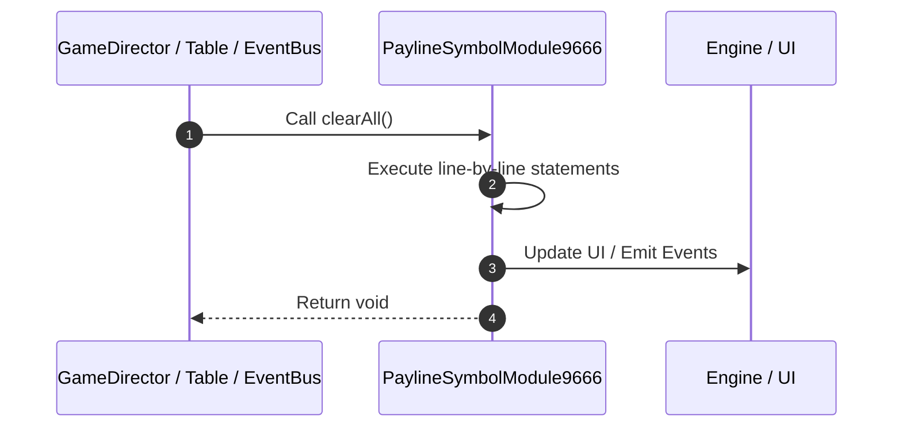

# 📖 `PaylineSymbolModule9666.clearAll()`

<!-- convention-summary-start -->
### PaylineSymbolModule9666.clearAll Line-by-Line Method Walkthrough Summary

- **Core Architecture / Purpose**: Technical reference, API contract, and integration guide for PaylineSymbolModule9666.clearAll Line-by-Line Method Walkthrough.
- **Key Mechanisms & Design**: Encapsulates core algorithms, event hooks, and performance optimizations within the slot framework runtime.
- **Domain Capabilities**: game_implement, 03_methods
- **Scope & Code Paths**: `file:///C:/Users/ADMIN/lamnino/cc20-new-all-in-one/assets/cc-release-slot/cc1-red-cliff/scripts/Payline/PaylineSymbolModule9666.ts`
- **Related Docs**: [Master Index](../INDEX.md)
<!-- convention-summary-end -->


---

## 1. Method Signature & Overview

```typescript
public clearAll(): void
```

- **Declaring Class**: `PaylineSymbolModule9666` ([`PaylineSymbolModule9666.ts`](file:///C:/Users/ADMIN/lamnino/cc20-new-all-in-one/assets/cc-release-slot/cc1-red-cliff/scripts/Payline/PaylineSymbolModule9666.ts))
- **Source Range**: Lines 62 to 73
- **Execution Cost**: $O(1)$ synchronous logic or timer Promise.

---

## 2. Complete Source Implementation

```typescript
	protected override clearAll(): void {
		const symbols = eno.ArrayUtils.flatOnce(this.mapTableSymbols).filter(Boolean);
		for (const symbol of symbols) {
			symbol.emit("ENABLE_HIGHLIGHT");
			const symbolModule = this.factory.getSymbolModule(symbol);
			if (symbolModule) {
				symbolModule.setOwner(SymbolOwnerType.REEL_SYMBOL);
			}
		}
		this.node.emit('STOP_ALL_COMBINE_EFFECTS');
		this.mapTableSymbols = [];
	}
```

---

## 3. Line-by-Line Code Breakdown

| Line # | Code Snippet | Technical Analysis & Engine Behavior |
| :---: | :--- | :--- |
| **62** | `protected override clearAll(): void {` | Method entry signature declaring `clearAll()` returning `void`. |
| **63** | `const symbols = eno.ArrayUtils.flatOnce(this.mapTableSymbols).filter(Boolean);` | Allocates local variable `symbols`. |
| **64** | `for (const symbol of symbols) {` | Executes core logic. |
| **65** | `symbol.emit("ENABLE_HIGHLIGHT");` | Executes core logic. |
| **66** | `const symbolModule = this.factory.getSymbolModule(symbol);` | Allocates local variable `symbolModule`. |
| **67** | `if (symbolModule) {` | Conditional guard evaluating branching prerequisite. |
| **68** | `symbolModule.setOwner(SymbolOwnerType.REEL_SYMBOL);` | Executes core logic. |
| **69** | `}` | Scope boundary closing block. |
| **70** | `}` | Scope boundary closing block. |
| **71** | `this.node.emit('STOP_ALL_COMBINE_EFFECTS');` | Executes core logic. |
| **72** | `this.mapTableSymbols = [];` | Executes core logic. |
| **73** | `}` | Scope boundary closing block. |

---

## 4. Execution Call Graph & Sequence


