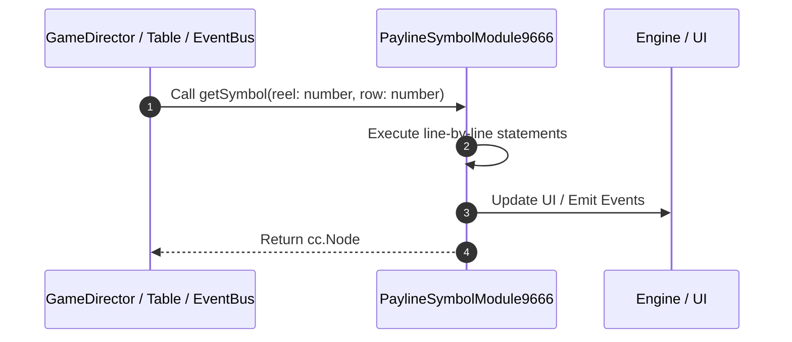

# 📖 `PaylineSymbolModule9666.getSymbol()`

<!-- convention-summary-start -->
### PaylineSymbolModule9666.getSymbol Line-by-Line Method Walkthrough Summary

- **Core Architecture / Purpose**: Technical reference, API contract, and integration guide for PaylineSymbolModule9666.getSymbol Line-by-Line Method Walkthrough.
- **Key Mechanisms & Design**: Encapsulates core algorithms, event hooks, and performance optimizations within the slot framework runtime.
- **Domain Capabilities**: game_implement, 03_methods
- **Scope & Code Paths**: `file:///C:/Users/ADMIN/lamnino/cc20-new-all-in-one/assets/cc-release-slot/cc1-red-cliff/scripts/Payline/PaylineSymbolModule9666.ts`
- **Related Docs**: [Master Index](../INDEX.md)
<!-- convention-summary-end -->


---

## 1. Method Signature & Overview

```typescript
public getSymbol(reel: number, row: number): cc.Node
```

- **Declaring Class**: `PaylineSymbolModule9666` ([`PaylineSymbolModule9666.ts`](file:///C:/Users/ADMIN/lamnino/cc20-new-all-in-one/assets/cc-release-slot/cc1-red-cliff/scripts/Payline/PaylineSymbolModule9666.ts))
- **Source Range**: Lines 11 to 29
- **Execution Cost**: $O(1)$ synchronous logic or timer Promise.

---

## 2. Complete Source Implementation

```typescript
	protected override getSymbol(reel: number, row: number): cc.Node {
		if (!this.matrix || !this.matrix[reel] || !this.matrix[reel][row]) {
			return null;
		}

		let symbol = this.mapTableSymbols[reel] ? this.mapTableSymbols[reel][row] : null;
		if (!symbol) {
			const index = this.paylineConfig.SYMBOL_INDEXES[reel][row];
			const symbolCode = this.matrix[reel][row];
			symbol = this.factory.getSymbolByIndex(index, SymbolOwnerType.PAYLINE);
			if (!symbol) {
				return null;
			}
			symbol["reel"] = reel;
			symbol["row"] = row;
		}

		return symbol;
	}
```

---

## 3. Line-by-Line Code Breakdown

| Line # | Code Snippet | Technical Analysis & Engine Behavior |
| :---: | :--- | :--- |
| **11** | `protected override getSymbol(reel: number, row: number): cc.Node {` | Method entry signature declaring `getSymbol(reel: number, row: number)` returning `cc.Node`. |
| **12** | `if (!this.matrix \|\| !this.matrix[reel] \|\| !this.matrix[reel][row]) {` | Conditional guard evaluating branching prerequisite. |
| **13** | `return null;` | Returns value or promise to calling sequence. |
| **14** | `}` | Scope boundary closing block. |
| **15** | `` | Executes core logic. |
| **16** | `let symbol = this.mapTableSymbols[reel] ? this.mapTableSymbols[reel][row] : null;` | Allocates local variable `symbol`. |
| **17** | `if (!symbol) {` | Conditional guard evaluating branching prerequisite. |
| **18** | `const index = this.paylineConfig.SYMBOL_INDEXES[reel][row];` | Allocates local variable `index`. |
| **19** | `const symbolCode = this.matrix[reel][row];` | Allocates local variable `symbolCode`. |
| **20** | `symbol = this.factory.getSymbolByIndex(index, SymbolOwnerType.PAYLINE);` | Executes core logic. |
| **21** | `if (!symbol) {` | Conditional guard evaluating branching prerequisite. |
| **22** | `return null;` | Returns value or promise to calling sequence. |
| **23** | `}` | Scope boundary closing block. |
| **24** | `symbol["reel"] = reel;` | Executes core logic. |
| **25** | `symbol["row"] = row;` | Executes core logic. |
| **26** | `}` | Scope boundary closing block. |
| **27** | `` | Executes core logic. |
| **28** | `return symbol;` | Returns value or promise to calling sequence. |
| **29** | `}` | Scope boundary closing block. |

---

## 4. Execution Call Graph & Sequence


