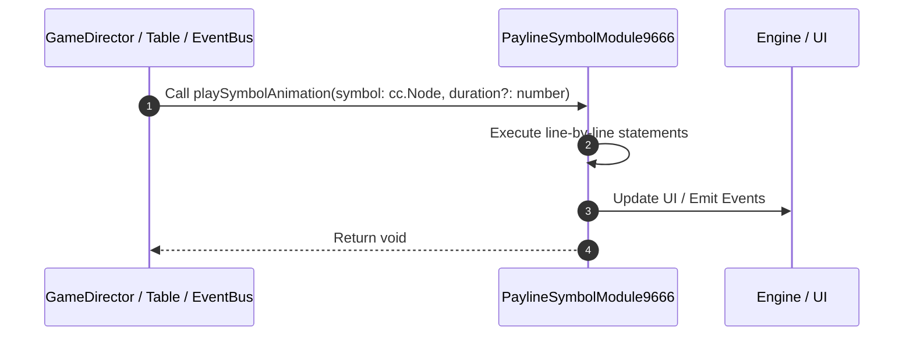

# 📖 `PaylineSymbolModule9666.playSymbolAnimation()`

<!-- convention-summary-start -->
### PaylineSymbolModule9666.playSymbolAnimation Line-by-Line Method Walkthrough Summary

- **Core Architecture / Purpose**: Technical reference, API contract, and integration guide for PaylineSymbolModule9666.playSymbolAnimation Line-by-Line Method Walkthrough.
- **Key Mechanisms & Design**: Encapsulates core algorithms, event hooks, and performance optimizations within the slot framework runtime.
- **Domain Capabilities**: game_implement, 03_methods
- **Scope & Code Paths**: `file:///C:/Users/ADMIN/lamnino/cc20-new-all-in-one/assets/cc-release-slot/cc1-red-cliff/scripts/Payline/PaylineSymbolModule9666.ts`
- **Related Docs**: [Master Index](../INDEX.md)
<!-- convention-summary-end -->


---

## 1. Method Signature & Overview

```typescript
public playSymbolAnimation(symbol: cc.Node, duration?: number): void
```

- **Declaring Class**: `PaylineSymbolModule9666` ([`PaylineSymbolModule9666.ts`](file:///C:/Users/ADMIN/lamnino/cc20-new-all-in-one/assets/cc-release-slot/cc1-red-cliff/scripts/Payline/PaylineSymbolModule9666.ts))
- **Source Range**: Lines 42 to 55
- **Execution Cost**: $O(1)$ synchronous logic or timer Promise.

---

## 2. Complete Source Implementation

```typescript
	protected override playSymbolAnimation(symbol: cc.Node, duration?: number): void {
		if (symbol && !symbol["orgParent"]) {
			symbol["orgParent"] = symbol.parent;
		}
		const isFast = this.gameSettings?.isTurboActive || this.gameSettings?.isFastToResult;
		const scaledDuration = isFast && duration ? duration / 2 : duration;
		super.playSymbolAnimation(symbol, scaledDuration);

		if (symbol) {
			const symbolModule = SlotSymbolModule.getModuleComponent(symbol);
			const sizeY = symbolModule && symbolModule.size ? symbolModule.size.y : 1;
			this.node.emit('PLAY_COMBINE_EFFECT', { symbol, sizeY });
		}
	}
```

---

## 3. Line-by-Line Code Breakdown

| Line # | Code Snippet | Technical Analysis & Engine Behavior |
| :---: | :--- | :--- |
| **42** | `protected override playSymbolAnimation(symbol: cc.Node, duration?: number): void {` | Method entry signature declaring `playSymbolAnimation(symbol: cc.Node, duration?: number)` returning `void`. |
| **43** | `if (symbol && !symbol["orgParent"]) {` | Conditional guard evaluating branching prerequisite. |
| **44** | `symbol["orgParent"] = symbol.parent;` | Executes core logic. |
| **45** | `}` | Scope boundary closing block. |
| **46** | `const isFast = this.gameSettings?.isTurboActive \|\| this.gameSettings?.isFastToResult;` | Allocates local variable `isFast`. |
| **47** | `const scaledDuration = isFast && duration ? duration / 2 : duration;` | Allocates local variable `scaledDuration`. |
| **48** | `super.playSymbolAnimation(symbol, scaledDuration);` | Delegates to parent superclass lifecycle implementation. |
| **49** | `` | Executes core logic. |
| **50** | `if (symbol) {` | Conditional guard evaluating branching prerequisite. |
| **51** | `const symbolModule = SlotSymbolModule.getModuleComponent(symbol);` | Allocates local variable `symbolModule`. |
| **52** | `const sizeY = symbolModule && symbolModule.size ? symbolModule.size.y : 1;` | Allocates local variable `sizeY`. |
| **53** | `this.node.emit('PLAY_COMBINE_EFFECT', { symbol, sizeY });` | Executes core logic. |
| **54** | `}` | Scope boundary closing block. |
| **55** | `}` | Scope boundary closing block. |

---

## 4. Execution Call Graph & Sequence


