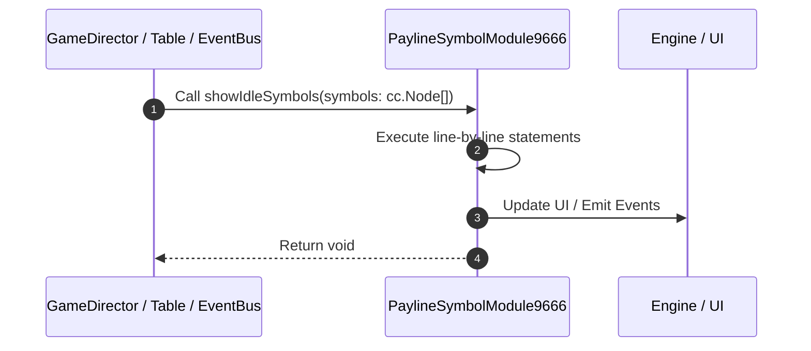

# 📖 `PaylineSymbolModule9666.showIdleSymbols()`

<!-- convention-summary-start -->
### PaylineSymbolModule9666.showIdleSymbols Line-by-Line Method Walkthrough Summary

- **Core Architecture / Purpose**: Technical reference, API contract, and integration guide for PaylineSymbolModule9666.showIdleSymbols Line-by-Line Method Walkthrough.
- **Key Mechanisms & Design**: Encapsulates core algorithms, event hooks, and performance optimizations within the slot framework runtime.
- **Domain Capabilities**: game_implement, 03_methods
- **Scope & Code Paths**: `file:///C:/Users/ADMIN/lamnino/cc20-new-all-in-one/assets/cc-release-slot/cc1-red-cliff/scripts/Payline/PaylineSymbolModule9666.ts`
- **Related Docs**: [Master Index](../INDEX.md)
<!-- convention-summary-end -->


---

## 1. Method Signature & Overview

```typescript
public showIdleSymbols(symbols: cc.Node[]): void
```

- **Declaring Class**: `PaylineSymbolModule9666` ([`PaylineSymbolModule9666.ts`](file:///C:/Users/ADMIN/lamnino/cc20-new-all-in-one/assets/cc-release-slot/cc1-red-cliff/scripts/Payline/PaylineSymbolModule9666.ts))
- **Source Range**: Lines 31 to 40
- **Execution Cost**: $O(1)$ synchronous logic or timer Promise.

---

## 2. Complete Source Implementation

```typescript
	protected override showIdleSymbols(symbols: cc.Node[]): void {
		const list = symbols || this.symbols;
		for (const symbol of list) {
			if (symbol && !symbol["orgParent"]) {
				symbol["orgParent"] = symbol.parent;
			}
		}
		this.node.emit('STOP_ALL_COMBINE_EFFECTS');
		super.showIdleSymbols(symbols);
	}
```

---

## 3. Line-by-Line Code Breakdown

| Line # | Code Snippet | Technical Analysis & Engine Behavior |
| :---: | :--- | :--- |
| **31** | `protected override showIdleSymbols(symbols: cc.Node[]): void {` | Method entry signature declaring `showIdleSymbols(symbols: cc.Node[])` returning `void`. |
| **32** | `const list = symbols \|\| this.symbols;` | Allocates local variable `list`. |
| **33** | `for (const symbol of list) {` | Executes core logic. |
| **34** | `if (symbol && !symbol["orgParent"]) {` | Conditional guard evaluating branching prerequisite. |
| **35** | `symbol["orgParent"] = symbol.parent;` | Executes core logic. |
| **36** | `}` | Scope boundary closing block. |
| **37** | `}` | Scope boundary closing block. |
| **38** | `this.node.emit('STOP_ALL_COMBINE_EFFECTS');` | Executes core logic. |
| **39** | `super.showIdleSymbols(symbols);` | Delegates to parent superclass lifecycle implementation. |
| **40** | `}` | Scope boundary closing block. |

---

## 4. Execution Call Graph & Sequence


