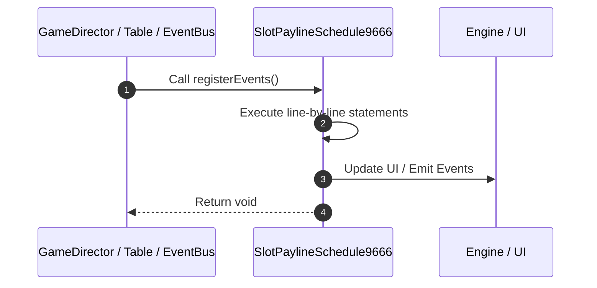

# 📖 `SlotPaylineSchedule9666.registerEvents()`

<!-- convention-summary-start -->
### SlotPaylineSchedule9666.registerEvents Line-by-Line Method Walkthrough Summary

- **Core Architecture / Purpose**: Technical reference, API contract, and integration guide for SlotPaylineSchedule9666.registerEvents Line-by-Line Method Walkthrough.
- **Key Mechanisms & Design**: Encapsulates core algorithms, event hooks, and performance optimizations within the slot framework runtime.
- **Domain Capabilities**: game_implement, 03_methods
- **Scope & Code Paths**: `file:///C:/Users/ADMIN/lamnino/cc20-new-all-in-one/assets/cc-release-slot/cc1-red-cliff/scripts/Payline/SlotPaylineSchedule9666.ts`
- **Related Docs**: [Master Index](../INDEX.md)
<!-- convention-summary-end -->


---

## 1. Method Signature & Overview

```typescript
public registerEvents(): void
```

- **Declaring Class**: `SlotPaylineSchedule9666` ([`SlotPaylineSchedule9666.ts`](file:///C:/Users/ADMIN/lamnino/cc20-new-all-in-one/assets/cc-release-slot/cc1-red-cliff/scripts/Payline/SlotPaylineSchedule9666.ts))
- **Source Range**: Lines 7 to 10
- **Execution Cost**: $O(1)$ synchronous logic or timer Promise.

---

## 2. Complete Source Implementation

```typescript
	registerEvents(): void {
		super.registerEvents();
		this.eventManager.on('SHOW_PAYLINE_WIN_AMOUNT', this.onShowPaylineAmount, this);
	}
```

---

## 3. Line-by-Line Code Breakdown

| Line # | Code Snippet | Technical Analysis & Engine Behavior |
| :---: | :--- | :--- |
| **7** | `registerEvents(): void {` | Method entry signature declaring `registerEvents()` returning `void`. |
| **8** | `super.registerEvents();` | Delegates to parent superclass lifecycle implementation. |
| **9** | `this.eventManager.on('SHOW_PAYLINE_WIN_AMOUNT', this.onShowPaylineAmount, this);` | Subscribes listener for `SHOW_PAYLINE_WIN_AMOUNT` event. |
| **10** | `}` | Scope boundary closing block. |

---

## 4. Execution Call Graph & Sequence


