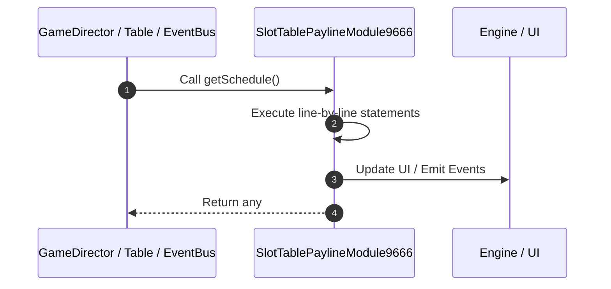

# 📖 `SlotTablePaylineModule9666.getSchedule()`

<!-- convention-summary-start -->
### SlotTablePaylineModule9666.getSchedule Line-by-Line Method Walkthrough Summary

- **Core Architecture / Purpose**: Technical reference, API contract, and integration guide for SlotTablePaylineModule9666.getSchedule Line-by-Line Method Walkthrough.
- **Key Mechanisms & Design**: Encapsulates core algorithms, event hooks, and performance optimizations within the slot framework runtime.
- **Domain Capabilities**: game_implement, 03_methods
- **Scope & Code Paths**: `file:///C:/Users/ADMIN/lamnino/cc20-new-all-in-one/assets/cc-release-slot/cc1-red-cliff/scripts/Payline/SlotTablePaylineModule9666.ts`
- **Related Docs**: [Master Index](../INDEX.md)
<!-- convention-summary-end -->


---

## 1. Method Signature & Overview

```typescript
public getSchedule(): any
```

- **Declaring Class**: `SlotTablePaylineModule9666` ([`SlotTablePaylineModule9666.ts`](file:///C:/Users/ADMIN/lamnino/cc20-new-all-in-one/assets/cc-release-slot/cc1-red-cliff/scripts/Payline/SlotTablePaylineModule9666.ts))
- **Source Range**: Lines 9 to 11
- **Execution Cost**: $O(1)$ synchronous logic or timer Promise.

---

## 2. Complete Source Implementation

```typescript
	protected getSchedule(): any {
		return this.getComponent(SlotPaylineSchedule9666) || this.addComponent(SlotPaylineSchedule9666);
	}
```

---

## 3. Line-by-Line Code Breakdown

| Line # | Code Snippet | Technical Analysis & Engine Behavior |
| :---: | :--- | :--- |
| **9** | `protected getSchedule(): any {` | Method entry signature declaring `getSchedule()` returning `any`. |
| **10** | `return this.getComponent(SlotPaylineSchedule9666) \|\| this.addComponent(SlotPaylineSchedule9666);` | Returns value or promise to calling sequence. |
| **11** | `}` | Scope boundary closing block. |

---

## 4. Execution Call Graph & Sequence


