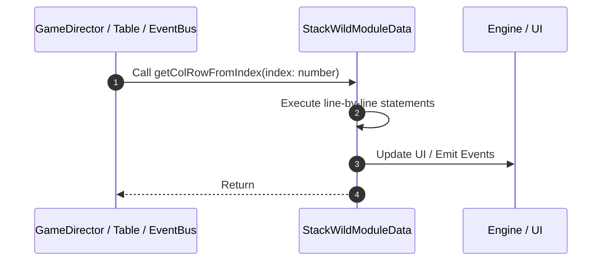

# 📖 `StackWildModuleData.getColRowFromIndex()`

<!-- convention-summary-start -->
### StackWildModuleData.getColRowFromIndex Line-by-Line Method Walkthrough Summary

- **Core Architecture / Purpose**: Technical reference, API contract, and integration guide for StackWildModuleData.getColRowFromIndex Line-by-Line Method Walkthrough.
- **Key Mechanisms & Design**: Encapsulates core algorithms, event hooks, and performance optimizations within the slot framework runtime.
- **Domain Capabilities**: game_implement, 03_methods
- **Scope & Code Paths**: `file:///C:/Users/ADMIN/lamnino/cc20-new-all-in-one/assets/cc-release-slot/cc1-red-cliff/scripts/Table/StackWildModuleData.ts`
- **Related Docs**: [Master Index](../INDEX.md)
<!-- convention-summary-end -->


---

## 1. Method Signature & Overview

```typescript
public getColRowFromIndex(index: number): 
```

- **Declaring Class**: `StackWildModuleData` ([`StackWildModuleData.ts`](file:///C:/Users/ADMIN/lamnino/cc20-new-all-in-one/assets/cc-release-slot/cc1-red-cliff/scripts/Table/StackWildModuleData.ts))
- **Source Range**: Lines 154 to 165
- **Execution Cost**: $O(1)$ synchronous logic or timer Promise.

---

## 2. Complete Source Implementation

```typescript
	getColRowFromIndex(index: number): { col: number, row: number } {
		const tableFormat = this._config.TABLE_FORMAT;
		let pointer = 0;
		for (let col = 0; col < tableFormat.length; col++) {
			const rowCount = tableFormat[col];
			if (index < pointer + rowCount) {
				return { col, row: index - pointer };
			}
			pointer += rowCount;
		}
		return { col: 0, row: 0 };
	}
```

---

## 3. Line-by-Line Code Breakdown

| Line # | Code Snippet | Technical Analysis & Engine Behavior |
| :---: | :--- | :--- |
| **154** | `getColRowFromIndex(index: number): { col: number, row: number } {` | Method entry signature declaring `getColRowFromIndex(index: number)` returning ``. |
| **155** | `const tableFormat = this._config.TABLE_FORMAT;` | Allocates local variable `tableFormat`. |
| **156** | `let pointer = 0;` | Allocates local variable `pointer`. |
| **157** | `for (let col = 0; col < tableFormat.length; col++) {` | Executes core logic. |
| **158** | `const rowCount = tableFormat[col];` | Allocates local variable `rowCount`. |
| **159** | `if (index < pointer + rowCount) {` | Conditional guard evaluating branching prerequisite. |
| **160** | `return { col, row: index - pointer };` | Returns value or promise to calling sequence. |
| **161** | `}` | Scope boundary closing block. |
| **162** | `pointer += rowCount;` | Executes core logic. |
| **163** | `}` | Scope boundary closing block. |
| **164** | `return { col: 0, row: 0 };` | Returns value or promise to calling sequence. |
| **165** | `}` | Scope boundary closing block. |

---

## 4. Execution Call Graph & Sequence


