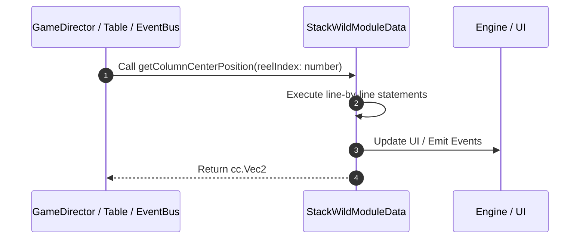

# 📖 `StackWildModuleData.getColumnCenterPosition()`

<!-- convention-summary-start -->
### StackWildModuleData.getColumnCenterPosition Line-by-Line Method Walkthrough Summary

- **Core Architecture / Purpose**: Technical reference, API contract, and integration guide for StackWildModuleData.getColumnCenterPosition Line-by-Line Method Walkthrough.
- **Key Mechanisms & Design**: Encapsulates core algorithms, event hooks, and performance optimizations within the slot framework runtime.
- **Domain Capabilities**: game_implement, 03_methods
- **Scope & Code Paths**: `file:///C:/Users/ADMIN/lamnino/cc20-new-all-in-one/assets/cc-release-slot/cc1-red-cliff/scripts/Table/StackWildModuleData.ts`
- **Related Docs**: [Master Index](../INDEX.md)
<!-- convention-summary-end -->


---

## 1. Method Signature & Overview

```typescript
public getColumnCenterPosition(reelIndex: number): cc.Vec2
```

- **Declaring Class**: `StackWildModuleData` ([`StackWildModuleData.ts`](file:///C:/Users/ADMIN/lamnino/cc20-new-all-in-one/assets/cc-release-slot/cc1-red-cliff/scripts/Table/StackWildModuleData.ts))
- **Source Range**: Lines 56 to 63
- **Execution Cost**: $O(1)$ synchronous logic or timer Promise.

---

## 2. Complete Source Implementation

```typescript
	getColumnCenterPosition(reelIndex: number): cc.Vec2 {
		const cellSize = this._config.cellSize;
		const tableFormat = this._config.TABLE_FORMAT;
		const tableWidth = tableFormat.length * cellSize.x;
		const offsetX = -tableWidth / 2 + cellSize.x / 2;
		const x = offsetX + reelIndex * cellSize.x;
		return new cc.Vec2(x, 0);
	}
```

---

## 3. Line-by-Line Code Breakdown

| Line # | Code Snippet | Technical Analysis & Engine Behavior |
| :---: | :--- | :--- |
| **56** | `getColumnCenterPosition(reelIndex: number): cc.Vec2 {` | Method entry signature declaring `getColumnCenterPosition(reelIndex: number)` returning `cc.Vec2`. |
| **57** | `const cellSize = this._config.cellSize;` | Allocates local variable `cellSize`. |
| **58** | `const tableFormat = this._config.TABLE_FORMAT;` | Allocates local variable `tableFormat`. |
| **59** | `const tableWidth = tableFormat.length * cellSize.x;` | Allocates local variable `tableWidth`. |
| **60** | `const offsetX = -tableWidth / 2 + cellSize.x / 2;` | Allocates local variable `offsetX`. |
| **61** | `const x = offsetX + reelIndex * cellSize.x;` | Allocates local variable `x`. |
| **62** | `return new cc.Vec2(x, 0);` | Returns value or promise to calling sequence. |
| **63** | `}` | Scope boundary closing block. |

---

## 4. Execution Call Graph & Sequence


