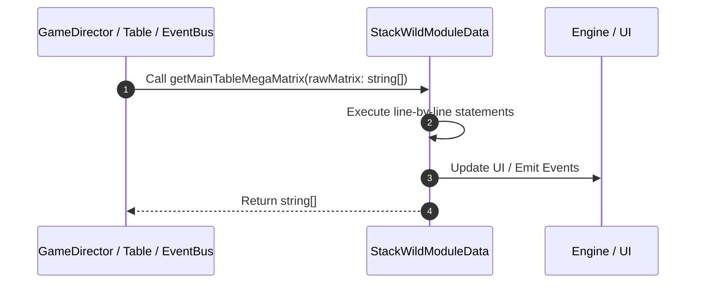

# 📖 `StackWildModuleData.getMainTableMegaMatrix()`

<!-- convention-summary-start -->
### StackWildModuleData.getMainTableMegaMatrix Line-by-Line Method Walkthrough Summary

- **Core Architecture / Purpose**: Technical reference, API contract, and integration guide for StackWildModuleData.getMainTableMegaMatrix Line-by-Line Method Walkthrough.
- **Key Mechanisms & Design**: Encapsulates core algorithms, event hooks, and performance optimizations within the slot framework runtime.
- **Domain Capabilities**: game_implement, 03_methods
- **Scope & Code Paths**: `file:///C:/Users/ADMIN/lamnino/cc20-new-all-in-one/assets/cc-release-slot/cc1-red-cliff/scripts/Table/StackWildModuleData.ts`
- **Related Docs**: [Master Index](../INDEX.md)
<!-- convention-summary-end -->


---

## 1. Method Signature & Overview

```typescript
public getMainTableMegaMatrix(rawMatrix: string[]): string[]
```

- **Declaring Class**: `StackWildModuleData` ([`StackWildModuleData.ts`](file:///C:/Users/ADMIN/lamnino/cc20-new-all-in-one/assets/cc-release-slot/cc1-red-cliff/scripts/Table/StackWildModuleData.ts))
- **Source Range**: Lines 137 to 141
- **Execution Cost**: $O(1)$ synchronous logic or timer Promise.

---

## 2. Complete Source Implementation

```typescript
	private getMainTableMegaMatrix(rawMatrix: string[]): string[] {
		if (!rawMatrix || rawMatrix.length === 0) return [];
		const megaFormatMatrix = this.getMegaSymbolsFormatMatrix();
		return eno.SlotUtils.convertMegaSymbols(rawMatrix, megaFormatMatrix);
	}
```

---

## 3. Line-by-Line Code Breakdown

| Line # | Code Snippet | Technical Analysis & Engine Behavior |
| :---: | :--- | :--- |
| **137** | `private getMainTableMegaMatrix(rawMatrix: string[]): string[] {` | Method entry signature declaring `getMainTableMegaMatrix(rawMatrix: string[])` returning `string[]`. |
| **138** | `if (!rawMatrix \|\| rawMatrix.length === 0) return [];` | Conditional guard evaluating branching prerequisite. |
| **139** | `const megaFormatMatrix = this.getMegaSymbolsFormatMatrix();` | Allocates local variable `megaFormatMatrix`. |
| **140** | `return eno.SlotUtils.convertMegaSymbols(rawMatrix, megaFormatMatrix);` | Returns value or promise to calling sequence. |
| **141** | `}` | Scope boundary closing block. |

---

## 4. Execution Call Graph & Sequence


